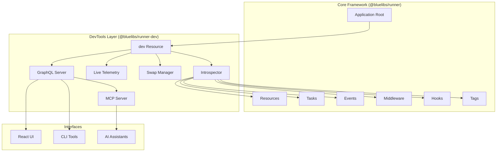
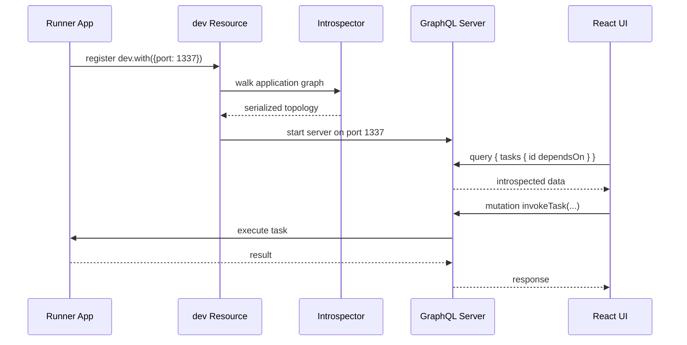

# @bluelibs/runner-dev

[](https://www.npmjs.com/package/@bluelibs/runner-dev)
[](https://opensource.org/licenses/MIT)

> DevTools for [@bluelibs/runner](https://runner.bluelibs.com) — introspection, live telemetry, hot-swapping, and a GraphQL API for your running app.

## Welcome

Runner Dev Tools provide introspection, live telemetry, and a GraphQL API to explore and query your running Runner app.

The way it works, is that this is a resource that opens a graphql server which opens your application to introspection.

If your runner primitives expose `toJSONSchema()` (for example matcher-based normalized schemas), runner-dev uses that as first-class schema export. `zod` schemas are also supported and converted to JSON Schema.

## Install

```bash
npm install -g @bluelibs/runner-dev
# or
npx @bluelibs/runner-dev
```

```ts
import { r } from "@bluelibs/runner";
import { dev } from "@bluelibs/runner-dev";

const app = r
  .resource("app")
  .register([
    // your resources,
    dev, // if you are fine with defaults or
    dev.with({
      port: 1337, // default,
      maxEntries: 10000, // how many logs to keep in the store.
    }),
  ])
  .build();
```

## What you get

- Fully-featured UI with AI assistance to explore your app, call tasks, emit events, diagnostics, logs and more.
- Overview tables across UI sections now include sortable and searchable columns (`ID`, `Title`, `Description`, `Used By`) with per-element usage counters.
- Overview tables now include `Visibility` (`Public`/`Private`) derived from Runner resource `isolate()` boundaries.
- Introspector: programmatic API to inspect tasks, hooks, resources, events, middleware, and diagnostics (including file paths, contents)
- Task introspection includes runtime `interceptorCount` / `hasInterceptors` (registered via `taskDependency.intercept(...)` in resource init).
- Resource introspection includes `isolation` (`deny`, `only`, `exports`, `exportsMode`) from `.isolate(...)`.
- Resource introspection includes `subtree` governance summaries (middleware attachment counts and validator counts per branch).
- Resource introspection indicates whether a resource exposes a `cooldown()` hook for shutdown lifecycle.
- Isolation wildcard rules are clickable in the docs UI and open a modal showing matched resources with inline filtering when lists are large.
- Event introspection includes `transactional`, `parallel`, optional `eventLane { laneId, orderingKey, metadata }`, and optional `rpcLane { laneId }`.
- Task introspection includes optional `rpcLane { laneId }`.
- Tag pages distinguish between directly tagged elements and tag handlers (elements that depend on the tag id).
- Live: in-memory logs and event emissions
- Live File Previews and Saving.
- GraphQL server: deep graph navigation over your app’s topology and live data
- CLI with scaffolding, query-ing capabilities on a live endpoint or via dry-run mode.
- MCP server: allow your AI to do introspection for you.

## Runner 6.0 Migration Notes

| Before                | After (hard switch)                                                                          |
| --------------------- | -------------------------------------------------------------------------------------------- |
| `Resource.exports`    | `Resource.isolation { deny, only, exports, exportsMode }`                                    |
| `Middleware.global`   | `Middleware.autoApply { enabled, scope, hasPredicate }`                                      |
| `Tag.middlewares`     | `Tag.taskMiddlewares` + `Tag.resourceMiddlewares`                                            |
| N/A                   | `Tag.errors`, `Tag.targets`                                                                  |
| `RunOptions.initMode` | `RunOptions.lifecycleMode` + `dispose.{ totalBudgetMs, drainingBudgetMs, cooldownWindowMs }` |
| N/A                   | `Resource.subtree`, `Resource.cooldown`                                                      |
| N/A                   | `Event.transactional`, `Event.parallel`, `Event.eventLane`, `Event.rpcLane`, `Task.rpcLane`  |
| `Resource.tunnelInfo` | Removed (hard switch to lane surfaces)                                                       |

## Runner 6.1 Migration Notes

- Temporal middleware now supports per-key partitioning through `keyBuilder(taskId, input)` on `rateLimit`, `debounce`, and `throttle`.
- Resource ownership is now fully structural for user resources:
  - normal resources can be registered directly at the root and passed to `run(...)`
  - canonical runtime IDs now retain each user resource segment
  - `runtime-framework-root` is reserved for internal Runner use
- `resource.subtree(...)` can now compose multiple policies with an array, and runner-dev merges them into one summarized introspection view.
- `gateway: true` has been removed from user resources. Update any string-based task/resource references that previously relied on transparent user resources.
- Advanced Node integrations should use the internal RPC lanes resource id `runner.node.rpcLanes`.

## Table of Contents

- [Quickstart Guide](#quickstart)
- [Model Context Protocol (MCP) Server](#cli-usage-mcp-server)
- [CLI Tooling & Scaffolding](#cli-usage-direct)
- [Live Telemetry & Correlation](#live-telemetry)
- [Hot-Swapping Debugging System](#hot-swapping-debugging-system)
- [GraphQL API Examples](#example-queries)
- [API Reference](API_REFERENCE.md)
- [Contributing & Local Dev](CONTRIBUTING.md)

## Quickstart

Register the Dev resources in your Runner root:

```ts
import { r } from "@bluelibs/runner";
import { dev } from "@bluelibs/runner-dev";

export const app = r
  .resource("app")
  .register([
    // You can omit .with() if you are fine with defaults.
    dev.with({
      port: 1337, // default
      maxEntries: 1000, // default
    }),
    // rest of your app.
  ])
  .build();
```

### Accessing the UI

Once your application is running with the `dev` resource, you can access the visual DevTools UI:

Open [http://localhost:1337](http://localhost:1337) in your browser.

Inside the UI, you can:

- Explore the resource graph.
- Manually invoke tasks with custom inputs.
- Inspect live logs and event emissions in real-time.
- View and edit files directly via the browser.

Add it as an Model Context Protocol Server (for AIs) via normal socket:

```json
{
  "mcpServers": {
    "mcp-graphql": {
      "description": "MCP Server for Active Running Context App",
      "command": "npx",
      "args": ["@bluelibs/runner-dev", "mcp"],
      "env": {
        "ENDPOINT": "http://localhost:1337/graphql",
        "ALLOW_MUTATIONS": "true"
      }
    }
  }
}
```

Then start your app as usual. The Dev GraphQL server will be available at http://localhost:1337/graphql.

### CLI usage (MCP server)

After installing, you can start the MCP server from this package via stdio.

Using npx:

```bash
ENDPOINT=http://localhost:1337/graphql npx -y @bluelibs/runner-dev mcp
```

Optional environment variables:

- `ALLOW_MUTATIONS=true` to enable `graphql.mutation`
- `HEADERS='{"Authorization":"Bearer token"}'` to pass extra headers

Available tools once connected:

- `graphql.query` — run read-only queries
- `graphql.mutation` — run mutations (requires `ALLOW_MUTATIONS=true`)
- `graphql.introspect` — fetch schema
- `graphql.ping` — reachability check
- `project.overview` — dynamic Markdown overview aggregated from the API

### CLI usage (direct)

This package also ships a CLI that can query the same GraphQL API or generate an overview directly from your terminal.

Prerequisites:

- Ensure your app registers the Dev GraphQL server (`dev.with({ port: 1337 })`) or otherwise expose a compatible endpoint.
- Alternatively, you can run queries in a new **dry‑run mode** with a TypeScript entry file (no server required).
- Build this package (or install it) so the binary is available.

Help:

```bash
runner-dev --help
```

Create new project:

```bash
# Create a new Runner project
runner-dev new <project-name>

# Example
runner-dev new my-awesome-app
```

This command creates a new Runner project with:

- Complete TypeScript setup with `tsx watch` for development
- Vitest configuration for testing without deprecated install-time transitive deps
- Package.json with all necessary dependencies
- Basic project structure with main.ts entry point
- README and .gitignore files

Flags for `new`:

- `--install`: install dependencies after scaffolding
- `--run-tests`: run the generated test suite (`npm run test`) after install
- `--run`: start the dev server (`npm run dev`) after install/tests; this keeps the process running

Examples:

```bash
# Create and auto-install dependencies, then run tests
new my-awesome-app --install --run-tests

# Create and start the dev server immediately (blocks)
new my-awesome-app --install --run
```

Scaffold artifacts (resource | task | event | tag | taskMiddleware | resourceMiddleware):

```bash
# General form
runner-dev new <kind> <name> [--ns app] [--dir src] [--export] [--dry]

# Examples
runner-dev new resource user-service --ns app --dir src --export
runner-dev new task create-user --ns app.users --dir src --export
runner-dev new event user-registered --ns app.users --dir src --export
runner-dev new tag http --ns app.web --dir src --export
runner-dev new task-middleware auth --ns app --dir src --export
runner-dev new resource-middleware soft-delete --ns app --dir src --export
```

Flags for artifact scaffolding:

- `--ns` / `--namespace`: namespace used for folders only, mapped to `<dir>/<ns>/<type>` (default: `app`)
- `--id <id>`: explicit local id override (for example: `save-user`)
- `--dir <dir>`: base directory under which files are created (default: `src`)
- `--export`: append a re-export to an `index.ts` in the target folder for better auto-import UX
- `--dry` / `--dry-run`: print the generated file without writing it

Conventions:

- Generated ids are local ids only and default to the kebab-cased artifact name
- Folders:
  - resources: `src/resources`
  - tasks: `src/tasks`
  - events: `src/events`
  - tags: `src/tags`
  - task middleware: `src/middleware/task`
  - resource middleware: `src/middleware/resource`
- The `--export` flag will add `export * from './<name>';` to the folder's `index.ts` (created if missing).

Tip: run `npx @bluelibs/runner-dev new help` to see the full usage and examples for artifact scaffolding.

Note: the `new` command requires the target directory to be empty. If the directory exists and is not empty, the command aborts with an error.

The project name must contain only letters, numbers, dashes, and underscores.

After creation, follow the next steps:

- `cd <project-name>`
- `npm install`
- `npm run dev`

Ping endpoint:

```bash
ENDPOINT=http://localhost:1337/graphql runner-dev ping
```

Run a query (two modes):

```bash
# Remote mode (HTTP endpoint)
ENDPOINT=http://localhost:1337/graphql runner-dev query 'query { tasks { id } }'

# With variables and pretty output
ENDPOINT=http://localhost:1337/graphql \
  runner-dev query \
  'query Q($ns: ID){ tasks(idIncludes: $ns) { id } }' \
  --variables '{"ns":"task."}' \
  --format pretty

# Add a namespace sugar to inject idIncludes/filter automatically
ENDPOINT=http://localhost:1337/graphql runner-dev query 'query { tasks { id } }' --namespace task.

# Dry‑run mode (no server) — uses a TS entry file
runner-dev query 'query { tasks { id } }' --entry-file ./src/main.ts
```

Dry‑run (no server) details:

```bash
# Using a TS entry file default export
runner-dev query 'query { tasks { id } }' \
  --entry-file ./src/main.ts

# Using a named export (e.g., exported as `app`)
runner-dev query 'query { tasks { id } }' \
  --entry-file ./src/main.ts --export app

# Notes
# - Dry‑run compiles your entry, builds the Runner Store in-memory, and executes the query against
#   an in-memory GraphQL schema. No HTTP server is started.
# - TypeScript only. Requires ts-node at runtime. If missing, you'll be prompted to install it.
# - Selection logic:
#   - If --entry-file is provided, dry‑run mode is used (no server).
#   - Otherwise, remote mode is used via --endpoint or ENDPOINT/GRAPHQL_ENDPOINT.
#   - If neither an endpoint nor an entry file is provided, the command errors.
```

Project overview (Markdown):

```bash
ENDPOINT=http://localhost:1337/graphql runner-dev overview --details 10 --include-live
```

Schema tools:

```bash
# SDL string
ENDPOINT=http://localhost:1337/graphql runner-dev schema sdl

# Introspection JSON
ENDPOINT=http://localhost:1337/graphql runner-dev schema json
```

Environment variables used by all commands:

- `ENDPOINT` (or `GRAPHQL_ENDPOINT`): GraphQL endpoint URL
- `HEADERS`: JSON for extra headers, e.g. `{"Authorization":"Bearer ..."}`

Flags:

- `--endpoint <url>`: override endpoint
- `--headers '<json>'`: override headers
- `--variables '<json>'`: JSON variables for query
- `--operation <name>`: operation name for documents with multiple operations
- `--format data|json|pretty`: output mode (default `data`)
- `--raw`: print full GraphQL envelope including errors
- `--namespace <str>`: convenience filter that injects `idIncludes` or `events(filter: { idIncludes })` at the top-level fields when possible
- `--entry-file <path>`: TypeScript entry file for dry‑run mode (no server)
- `--export <name>`: named export to use from the entry (default export preferred)

Precedence:

- If `--entry-file` is present, dry‑run mode is used.
- Otherwise, remote mode via `--endpoint`/`ENDPOINT` is used.

### CLI Summary

| Category        | Description                                               |
| --------------- | --------------------------------------------------------- |
| **New Project** | `runner-dev new <project-name>`                           |
| **Scaffolding** | `runner-dev new <resource\|task\|event\|tag\|middleware>` |
| **Queries**     | `runner-dev query 'query { ... }'`                        |
| **Overview**    | `runner-dev overview --details 10`                        |
| **Schema**      | `runner-dev schema sdl`                                   |

---

## GraphQL API Examples

For a full list of types and fields, see the [API Reference](API_REFERENCE.md).

### Explore tasks and dependencies deeply

- Explore tasks and dependencies deeply

```graphql
query {
  tasks {
    id
    filePath
    emits
    emitsResolved {
      id
    }
    dependsOn
    middleware
    middlewareResolved {
      id
    }
    dependsOnResolved {
      tasks {
        id
      }
      resources {
        id
      }
      emitters {
        id
      }
    }
  }
}
```

- Diagnostics

```graphql
query {
  diagnostics {
    severity
    code
    message
    nodeId
    nodeKind
  }
}
```

- Traverse from middleware to dependents, then back to their middleware

```graphql
query {
  middlewares {
    id
    usedByTasksResolved {
      id
      middlewareResolved {
        id
      }
    }
    usedByResourcesResolved {
      id
    }
    emits {
      id
    }
  }
}
```

- Events and hooks

```graphql
query {
  events {
    id
    emittedBy
    emittedByResolved {
      id
    }
    listenedToBy
    listenedToByResolved {
      id
    }
  }
}
```

## Live Telemetry

The `live` resource records:

- Logs emitted via `globals.events.log`
- All event emissions (via an internal global `on: "*"` hook)

GraphQL (basic):

```graphql
query {
  live {
    logs(afterTimestamp: 0) {
      timestampMs
      level
      message
      data # stringified JSON if object, otherwise null
    }
    emissions(afterTimestamp: 0) {
      timestampMs
      eventId
      emitterId
      payload # stringified JSON if object, otherwise null
    }
    errors(afterTimestamp: 0) {
      timestampMs
      sourceId
      sourceKind
      message
    }
    runs(afterTimestamp: 0) {
      timestampMs
      nodeId
      nodeKind
      durationMs
      ok
      parentId
      rootId
      correlationId
    }
  }
}
```

Filter by timestamp (ms) to retrieve only recent entries.

GraphQL (with filters and last):

```graphql
query {
  live {
    logs(
      last: 100
      filter: { levels: [debug, error], messageIncludes: "probe" }
    ) {
      timestampMs
      level
      message
      correlationId
    }
    emissions(
      last: 50
      filter: { eventIds: ["evt.hello"], emitterIds: ["task.id"] }
    ) {
      eventId
      emitterId
    }
    errors(
      last: 10
      filter: { sourceKinds: [TASK, RESOURCE], messageIncludes: "boom" }
    ) {
      sourceKind
      message
    }
    runs(afterTimestamp: 0, last: 5, filter: { ok: true, nodeKinds: [TASK] }) {
      nodeId
      durationMs
      ok
      correlationId
    }
  }
}
```

### Live system health

- **memory: `MemoryStats!`**
  - Fields: `heapUsed` (bytes), `heapTotal` (bytes), `rss` (bytes)
- **cpu: `CpuStats!`**
  - Fields: `usage` (0..1 event loop utilization), `loadAverage` (1‑minute load avg)
- **eventLoop(reset: Boolean): `EventLoopStats!`**
  - Fields: `lag` (ms, avg delay via `monitorEventLoopDelay`)
  - Args: `reset` optionally clears the histogram after reading
- **gc(windowMs: Float): `GcStats!`**
  - Fields: `collections` (count), `duration` (ms)
  - Args: `windowMs` returns stats only within the last window; omitted = totals since process start

Example query:

```graphql
query SystemHealth {
  live {
    memory {
      heapUsed
      heapTotal
      rss
    }
    cpu {
      usage
      loadAverage
    }
    eventLoop(reset: true) {
      lag
    }
    gc(windowMs: 10000) {
      collections
      duration
    }
  }
}
```

Notes:

- `heap*` and `rss` are bytes.
- `cpu.usage` is a ratio; `loadAverage` is 1‑minute OS load.
- `eventLoop.lag` may be 0 if `monitorEventLoopDelay` is unavailable.

### SSE Live Streaming

In addition to GraphQL polling, the server exposes a **Server-Sent Events** endpoint at `GET /live/stream` for near-instant telemetry delivery:

```http
GET /live/stream
Accept: text/event-stream
```

The endpoint pushes two event types:

| Event       | Cadence                                      | Payload                                                     |
| ----------- | -------------------------------------------- | ----------------------------------------------------------- |
| `telemetry` | ~100ms after each `record*` call (debounced) | `{ logs, emissions, errors, runs }` (delta since last push) |
| `health`    | Every 2s                                     | `{ memory, cpu, eventLoop, gc }`                            |

A heartbeat comment (`: heartbeat`) is sent every 15s to keep the connection alive through proxies.

**JavaScript client example:**

```js
const es = new EventSource("http://localhost:1337/live/stream");
es.addEventListener("telemetry", (e) => {
  const { logs, emissions, errors, runs } = JSON.parse(e.data);
  // merge into your state
});
es.addEventListener("health", (e) => {
  const { memory, cpu, eventLoop, gc } = JSON.parse(e.data);
});
```

The built-in Live Panel UI automatically uses SSE when available and falls back to configurable-interval polling (500ms–10s slider) when SSE is not supported.

**Programmatic notification hook:** The `Live` interface exposes `onRecord(callback)` which fires synchronously whenever a `record*` method is called, returning an unsubscribe function. This is the mechanism the SSE endpoint uses internally.

### Correlation and call chains

- What is correlationId? An opaque UUID (via `crypto.randomUUID()`) created for the first task in a run chain.
- How is it formed?
  - When a task starts, a middleware opens an AsyncLocalStorage scope containing:
    - `correlationId`: a UUID for the chain
    - `chain`: ordered array of node ids representing the call path
  - Nested tasks and listeners reuse the same AsyncLocalStorage scope, so the same `correlationId` flows throughout the chain.
- What does it contain? Only a UUID string. No payload, no PII.
- Where is it recorded?
  - `logs.correlationId`
  - `emissions.correlationId`
  - `errors.correlationId`
  - `runs.correlationId` plus `runs.parentId` and `runs.rootId` for chain topology
- How to use it
  - Read a recent run to discover a correlation id, then filter logs by it:

```graphql
query TraceByCorrelation($ts: Float, $cid: String!) {
  live {
    runs(afterTimestamp: $ts, last: 10) {
      nodeId
      parentId
      rootId
      correlationId
    }
    logs(last: 100, filter: { correlationIds: [$cid] }) {
      timestampMs
      level
      message
      correlationId
    }
  }
}
```

#### Trace View (UI)

The Live Panel includes a built-in **Trace View** — click any `correlationId` badge in the Logs, Events, Errors, or Runs sub-tabs to open a unified timeline modal showing every entry that shares that ID, ordered chronologically. Each entry is color-coded by kind (log, event, error, run) with a vertical timeline gutter, relative offset labels, and expandable details. This provides an in-process "distributed tracing" experience similar to Jaeger or Zipkin, but entirely within the Dev UI.

#### Unified Modal System

All Dev UI modals (code viewer, execute, trace view, log details, stats overlay) share a common `BaseModal` primitive that provides portal rendering, backdrop blur, focus trap, scroll lock, slide-up animation, and ARIA dialog semantics. A `ModalStackContext` manages stacking so modals can open on top of other modals — each layer gets a higher z-index and the global <kbd>Esc</kbd> key always closes the topmost one first.

## Emitting Events (Runner-native)

- Define an event:

```ts
import { r } from "@bluelibs/runner";

export const userCreated = r.event<{ id: string; name: string }>("userCreated").build();
```

- Use it in a task:

```ts
import { r } from "@bluelibs/runner";
import { userCreated } from "./events";

export const createUser = r
  .task<{ name: string }>("createUser")
  .dependencies({ userCreated })
  .run(async (input, { userCreated }) => {
    const id = crypto.randomUUID();
    await userCreated({ id, name: input.name });
    return { id };
  })
  .build();
```

- Emit logs:

```ts
import { globals, r } from "@bluelibs/runner";

export const logSomething = r
  .task("logSomething")
  .dependencies({ logger: globals.resources.logger })
  .run(async (_i, { logger }) => {
    logger.info("Hello world!");
  })
  .build();
```

## Notes on Overrides

- If a resource overrides another registerable, the overridden node remains discoverable but marked with `overriddenBy`.
- Only the active definition exists; we do not retain a shadow copy of the original.

## Guidelines & DX

- No `any` in APIs; strong types for nodes and relations
- Non-null lists with non-null items (`[T!]!`) in GraphQL
- Deep “resolved” fields for easy graph traversal
- File-aware enhancements (`filePath`, `fileContents`, etc.)

For full details on development, testing, and codegen, see [CONTRIBUTING.md](CONTRIBUTING.md).

## Hot-Swapping Debugging System

**Revolutionary live debugging feature that allows AI assistants and developers to dynamically replace task run functions in live applications.**

### Overview

The hot-swapping system enables:

- **Live Function Replacement**: Replace any task's `run` function with new TypeScript/JavaScript code without restarting the application
- **TypeScript Compilation**: Automatic compilation and validation of swapped code
- **GraphQL API**: Remote swap operations via GraphQL mutations
- **Live Telemetry Integration**: Real-time capture of debug logs from swapped functions
- **Rollback Support**: Easy restoration to original functions
- **Type Safety**: 100% type-safe implementation with comprehensive error handling

### Quick Setup

Add the swap manager to your app:

```ts
import { r } from "@bluelibs/runner";
import { resources as dev } from "@bluelibs/runner-dev";

export const app = r
  .resource("app")
  .register([
    // Core dev resources
    dev.live,
    dev.introspector,

    // Add the swap manager for hot-swapping
    dev.swapManager,

    // GraphQL server with swap mutations
    dev.server.with({ port: 1337 }),
  ])
  .build();
```

### GraphQL API

#### Queries

**Get the effective run options (how the app was started):**

```graphql
query {
  runOptions {
    mode
    debug
    rootId
  }
}
```

**Get currently swapped tasks:**

```graphql
query {
  swappedTasks {
    taskId
    swappedAt
    originalCode
  }
}
```

#### Mutations

**Swap a task's run function:**

```graphql
mutation SwapTask($taskId: ID!, $runCode: String!) {
  swapTask(taskId: $taskId, runCode: $runCode) {
    success
    error
    taskId
  }
}
```

**Restore original function:**

```graphql
mutation UnswapTask($taskId: ID!) {
  unswapTask(taskId: $taskId) {
    success
    error
    taskId
  }
}
```

**Restore all swapped tasks:**

```graphql
mutation UnswapAllTasks {
  unswapAllTasks {
    success
    error
    taskId
  }
}
```

### Usage Examples

#### Basic Function Swapping

Replace a task's logic with enhanced debugging:

```graphql
mutation {
  swapTask(
    taskId: "user.create"
    runCode: """
    async function run(input, deps) {
      // Add comprehensive logging
      if (deps.emitLog) {
        await deps.emitLog({
          timestamp: new Date(),
          level: "info",
          message: "DEBUG: Creating user started",
          data: { input }
        });
      }

      // Enhanced validation
      if (!input.email || !input.email.includes('@')) {
        throw new Error('Invalid email address');
      }

      // Original logic with debugging
      const result = {
        id: crypto.randomUUID(),
        email: input.email,
        createdAt: new Date().toISOString(),
        debugInfo: {
          swappedAt: Date.now(),
          inputValidated: true
        }
      };

      if (deps.emitLog) {
        await deps.emitLog({
          timestamp: new Date(),
          level: "info",
          message: "DEBUG: User created successfully",
          data: { result }
        });
      }

      return result;
    }
    """
  ) {
    success
    error
  }
}
```

#### TypeScript Support

The system supports full TypeScript syntax:

```graphql
mutation {
  swapTask(
    taskId: "data.processor"
    runCode: """
    async function run(input: { items: string[] }, deps: any): Promise<{ processed: number }> {
      const items: string[] = input.items || [];
      let processed: number = 0;

      for (const item of items) {
        if (typeof item === 'string' && item.length > 0) {
          processed++;
        }
      }

      return { processed };
    }
    """
  ) {
    success
    error
  }
}
```

#### Arrow Functions and Function Bodies

Multiple code formats are supported:

```graphql
# Arrow function
mutation {
  swapTask(
    taskId: "simple.task"
    runCode: "() => ({ message: 'Hello from arrow function!' })"
  ) {
    success
  }
}

# Function body only
mutation {
  swapTask(
    taskId: "another.task"
    runCode: """
    const result = { timestamp: Date.now() };
    return result;
    """
  ) {
    success
  }
}
```

### Live Telemetry Integration

Swapped functions can emit logs that are captured by the live telemetry system:

```graphql
# After swapping with debug logging, query the logs
query RecentDebugLogs {
  live {
    logs(last: 50, filter: { messageIncludes: "DEBUG" }) {
      timestampMs
      level
      message
      data
      correlationId
    }
  }
}
```

### Safety and Best Practices

#### Type Safety

- No `as any` usage throughout the implementation
- Full TypeScript type checking and compilation
- Comprehensive error validation and reporting

#### Security Considerations

- Code is executed via `eval()` in the Node.js context
- Intended for development/debugging environments only
- Swapped functions have access to the same context as original functions

#### Best Practices

- Use descriptive debug messages in swapped functions
- Leverage the logging system for telemetry capture
- Test swapped functions thoroughly before deployment
- Always restore original functions after debugging

#### Error Recovery

- Failed swaps don't affect the original function
- State tracking prevents inconsistencies
- Easy rollback with `unswapAllTasks` mutation

### AI Assistant Integration

This system is specifically designed for AI debugging workflows:

1. **AI analyzes application behavior** via introspection and live telemetry
2. **AI identifies issues** in specific tasks or functions
3. **AI generates enhanced debug code** with additional logging and validation
4. **AI swaps the function remotely** via GraphQL mutations
5. **AI monitors enhanced telemetry** to understand the issue
6. **AI restores original function** once debugging is complete

### Remote Task Execution

The system provides `invokeTask` functionality for remotely executing tasks with JSON input/output serialization, perfect for AI-driven debugging and testing.

#### Basic Task Invocation

```graphql
mutation {
  invokeTask(taskId: "user.create") {
    success
    error
    taskId
    result
    executionTimeMs
    invocationId
  }
}
```

#### Task Invocation with Input

```graphql
mutation {
  invokeTask(
    taskId: "user.create"
    inputJson: "{\"email\": \"test@example.com\", \"name\": \"John Doe\"}"
  ) {
    success
    result
    executionTimeMs
  }
}
```

#### JavaScript Input Evaluation

For advanced debugging scenarios, use `evalInput: true` to evaluate JavaScript expressions instead of parsing JSON:

```graphql
mutation {
  invokeTask(
    taskId: "data.processor"
    inputJson: """
    {
      timestamp: new Date("2023-01-01"),
      data: [1, 2, 3].map(x => x * 2),
      config: {
        retries: Math.max(3, process.env.NODE_ENV === 'prod' ? 5 : 1),
        timeout: 30 * 1000
      },
      processData: (items) => items.filter(x => x > 0)
    }
    """
    evalInput: true
  ) {
    success
    result
    executionTimeMs
  }
}
```

#### Pure Mode (Bypass Middleware)

Pure mode executes tasks with computed dependencies directly from the store, bypassing the middleware pipeline and authentication systems for clean testing:

```graphql
mutation {
  invokeTask(
    taskId: "user.create"
    inputJson: "{\"email\": \"test@example.com\"}"
    pure: true
  ) {
    success
    result
    executionTimeMs
  }
}
```

#### AI Debugging Workflow

1. **Swap task with enhanced debugging**:

```graphql
mutation {
  swapTask(
    taskId: "user.create"
    runCode: """
    async function run(input, deps) {
      console.log('Input received:', input);
      const result = { id: Math.random(), ...input };
      console.log('Result generated:', result);
      return result;
    }
    """
  ) {
    success
  }
}
```

2. **Invoke task to test behavior**:

```graphql
mutation {
  invokeTask(
    taskId: "user.create"
    inputJson: """
    {
      email: "debug@test.com",
      createdAt: new Date(),
      metadata: {
        source: "ai-debug",
        sessionId: crypto.randomUUID(),
        testData: [1, 2, 3].map(x => x * 10)
      }
    }
    """
    pure: true
    # Activation of eval() for smarter inputs.
    evalInput: true
  ) {
    success
    result
    executionTimeMs
  }
}
```

3. **Monitor live telemetry for debug output**:

```graphql
query {
  live {
    logs(last: 10) {
      level
      message
      data
      timestampMs
    }
  }
}
```

#### JSON Serialization

The system automatically handles complex JavaScript types:

- **Primitives**: strings, numbers, booleans preserved exactly
- **Objects/Arrays**: Deep serialization with proper structure
- **Functions**: Converted to `[Function: name]` strings
- **Undefined**: Converted to `[undefined]` strings
- **Dates**: Serialized as ISO strings
- **Circular References**: Safely handled to prevent errors

#### Input Processing Modes

**JSON Mode (default)**: `evalInput: false`

- Input is parsed as JSON using `JSON.parse()`
- Safe for structured data
- Limited to JSON-compatible types

**JavaScript Evaluation Mode**: `evalInput: true`

- Input is evaluated as JavaScript using `eval()`
- Supports complex expressions, function calls, Date objects, calculations
- Full access to JavaScript runtime and built-in objects
- Perfect for AI-driven testing with dynamic inputs

### Arbitrary Code Evaluation

For advanced debugging, the system provides an `eval` mutation to execute arbitrary JavaScript/TypeScript code on the server.

**Security Warning**: This feature is powerful and executes code with the same privileges as the application. It is intended for development environments only and is disabled by default in production. To enable it, set the environment variable `RUNNER_DEV_EVAL=1`.

#### `eval` Mutation

**Execute arbitrary code:**

```graphql
mutation EvalCode($code: String!, $inputJson: String, $evalInput: Boolean) {
  eval(code: $code, inputJson: $inputJson, evalInput: $evalInput) {
    success
    error
    result # JSON string
    executionTimeMs
  }
}
```

- `code`: The JavaScript/TypeScript code to execute.
- `inputJson`: Optional input string, parsed as JSON by default.
- `evalInput`: If `true`, `inputJson` is evaluated as a JavaScript expression.

**Example:**

```graphql
mutation {
  eval(code: "return { a: 1, b: process.version }") {
    success
    result
  }
}
```

### Use Cases

- **Production Debugging**: Add logging to specific functions without restarts
- **A/B Testing**: Compare different function implementations live
- **Performance Monitoring**: Inject performance measurements
- **Error Investigation**: Add error handling and detailed logging
- **Feature Development**: Test new logic before permanent implementation
- **AI-Driven Debugging**: Enable AI assistants to debug applications autonomously

### Architecture

The hot-swapping system is organized into five high-level capabilities:

- **Execution Control**: swaps task `run` implementations at runtime and supports rollback.
- **Validation Pipeline**: parses and compiles submitted code before activation.
- **API Surface**: exposes swap and restore operations through GraphQL mutations.
- **Observability**: integrates with live telemetry so swapped behavior can be inspected immediately.
- **Safety Controls**: isolates failures to the attempted swap and preserves previous task behavior when validation fails.

The implementation remains fully type-safe and is covered by both unit and GraphQL integration tests.

---

## System Architecture

### Overview

Runner-Dev is built as a modular system of resources that integrate with the @bluelibs/runner framework to provide comprehensive development tools. The architecture follows a resource-based composition pattern where each component is a self-contained resource that can be registered and configured independently.

### Core Components



### Component Responsibilities (High-Level)

| Layer                       | Responsibility                                                                   |
| --------------------------- | -------------------------------------------------------------------------------- |
| **Composition Layer**       | Registers and wires DevTools capabilities into the Runner application lifecycle. |
| **Introspection Layer**     | Builds a runtime model of tasks, resources, events, middleware, hooks, and tags. |
| **Observability Layer**     | Captures logs, emissions, errors, runs, and health metrics for analysis.         |
| **Execution Control Layer** | Supports remote task invocation and controlled hot-swapping workflows.           |
| **Access Layer**            | Exposes a GraphQL API and transports for UI, CLI, and MCP clients.               |

### Data Flow



### Key Architectural Patterns

1. **Resource-Based Composition**: Everything in Runner is a resource that can be registered and composed. The dev tools themselves are resources.

2. **Introspection System**: The Introspector walks the application graph at runtime, extracting metadata about:

   - Tasks (dependencies, emissions, interceptors)
   - Resources (isolation rules, subtree governance, cooldown hooks)
   - Events (listeners, transactional/parallel modes, lanes)
   - Middleware (auto-apply scopes, tags)
   - Tags (cross-cutting concerns with handlers)

3. **Live Telemetry**: In-memory store for recent activity with SSE streaming via `/live/stream`

4. **Hot-Swapping**: Modify task implementations without restart via `swapTask` mutation

5. **GraphQL API**: Full schema at `src/schema/` with queries for architecture and mutations for invocation/swapping

6. **MCP Integration**: AI assistants can connect via Model Context Protocol to introspect and interact with running apps

### Entry Points

- **Main export**: `src/index.ts` - exports `dev` resource and types
- **CLI entry**: `src/cli.ts` - command-line interface
- **MCP entry**: `src/mcp.ts` - Model Context Protocol server
- **UI entry**: `src/ui/index.html` - React documentation UI
