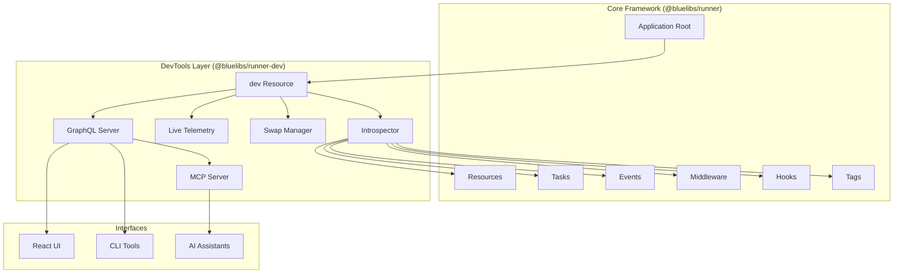
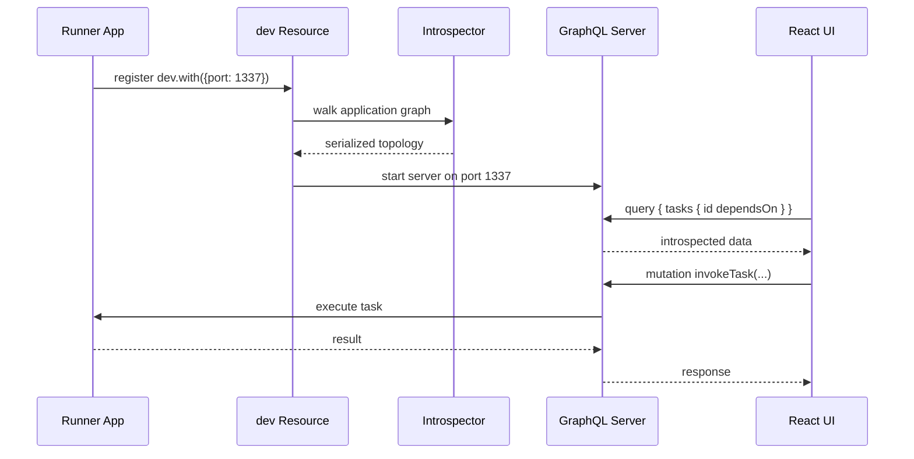

# @bluelibs/runner-dev

[](https://www.npmjs.com/package/@bluelibs/runner-dev)
[](https://opensource.org/licenses/MIT)

> DevTools for [@bluelibs/runner](https://runner.bluelibs.com) — introspection, live telemetry, hot-swapping, and a GraphQL API for your running app.

## Welcome

Runner Dev Tools provide introspection, live telemetry, and a GraphQL API to explore and query your running Runner app.

The way it works, is that this is a resource that opens a graphql server which opens your application to introspection.

If your runner primitives expose `toJSONSchema()` (for example matcher-based normalized schemas), runner-dev uses that as first-class schema export. `zod` schemas are also supported and converted to JSON Schema.

## Install

```bash
npm install -g @bluelibs/runner-dev
# or
npx @bluelibs/runner-dev
```

Requirements: Node.js 22+ (`engines: ">=22"`, the same floor as Runner 6.6) and `@bluelibs/runner` ^6.6.0 as a peer dependency. `typescript` 5 or 6 is an optional peer, needed only for `swapTask`, `eval` and `shell` (see [Hot-Swapping](#hot-swapping-debugging-system)).

For local `AGENTS.md`-style workflows, this repo now extracts Runner skills from `@bluelibs/runner` into `.agents/skills` via `npm-skills` on `postinstall`.
Runner-Dev also publishes its own skill from `skills/core`. Treat `README.md`, `skills/core/SKILL.md`, `skills/core/references/README.md` and `skills/core/references/readmes/COMPACT_GUIDE.md` as one documentation unit and keep them aligned (together with `readmes/API_REFERENCE.md`). `skills/core/references/README.md` and `skills/core/references/readmes/` are symlinks to this `README.md` and to `readmes/`, so edit the originals and leave the links in place. The docs UI now includes a topology view for blast-radius and resource mindmap exploration. Release notes live in [CHANGELOG.md](CHANGELOG.md).

```ts
import { r } from "@bluelibs/runner";
import { dev } from "@bluelibs/runner-dev";

const app = r
  .resource("app")
  .register([
    // your resources,
    dev, // if you are fine with defaults or
    dev.with({
      port: 1337, // default,
      host: "127.0.0.1", // default: this machine only; see "Network and code-execution defaults"
      allowedHosts: [], // extra DNS names requests may use besides localhost and IP addresses
      maxEntries: 10000, // default: entries kept per live category (a positive integer)
    }),
  ])
  .build();
```

## What you get

- Fully-featured UI with AI assistance to explore your app, call tasks, emit events, diagnostics, logs and more.
- Runtime shell (REPL) in the UI and via the `shell` GraphQL mutation: per-resource shells bind `r` to the live resource value, plus a global shell with full `runtime` access.
- Static catalog export via `exportDocs(app, { output?, overwrite? })` for a standalone frozen docs site under `./runner-dev-catalog` by default.
- Overview tables across UI sections now include sortable and searchable columns (`ID`, `Title`, `Description`, `Used By`) with per-element usage counters, keyboard-reachable sorting, and a detail pager that follows the table's order (see [Docs UI tables and blast radius](#docs-ui-tables-and-blast-radius)).
- Overview tables mark private elements with a tag under the title (visibility derived from Runner resource `isolate()` boundaries).
- Task and resource cards show where each middleware comes from: middleware applied by an owner's `subtree(...)` policy gets a `Subtree Policy` badge and a `Source:` link to the owning resource.
- Introspector: programmatic API to inspect tasks, hooks, resources, events, middleware, and diagnostics (including file paths, contents)
- Task introspection includes runtime `interceptorCount` / `hasInterceptors` (registered via `taskDependency.intercept(...)` in resource init).
- Resource introspection includes `isolation` (`deny`, `only`, `exports`, `exportsMode`) from `.isolate(...)`.
- GraphQL exposes effective resource boundary surfaces, including declared exports, definitions reachable through exported resources, and private definitions.
- Resource introspection includes `subtree` governance summaries (middleware attachment counts and validator counts per branch).
- Resource introspection indicates whether a resource exposes a `cooldown()` hook for shutdown lifecycle.
- Isolation wildcard rules are clickable in the docs UI and open a modal showing matched resources with inline filtering when lists are large.
- Event introspection includes `transactional`, `parallel`, optional `eventLane { laneId }`, and optional `rpcLane { laneId }`.
- Task introspection includes optional `rpcLane { laneId }`.
- Tag pages distinguish between directly tagged elements and tag handlers (elements that depend on the tag id).
- Live: in-memory logs, event emissions, errors and task/hook runs, with a `sequence` cursor that pages and streams the retained entries without gaps
- Live File Previews and Saving (saving needs the [code-execution gate](#code-execution-gate) open).
- GraphQL server: deep graph navigation over your app’s topology and live data
- CLI with scaffolding, query-ing capabilities on a live endpoint or via dry-run mode.
- MCP server: allow your AI to do introspection for you.
- Safe defaults: the server listens on `127.0.0.1`, a Host header check guards every bind against DNS rebinding, and code execution (`eval`, `shell`, `swapTask`, `evalInput`, `editFile`) stays off unless you opt in.

## Runner 6.0 Migration Notes

| Before                | After (hard switch)                                                                          |
| --------------------- | -------------------------------------------------------------------------------------------- |
| `Resource.exports`    | `Resource.isolation { deny, only, exports, exportsMode }`                                    |
| `Middleware.global`   | `Middleware.autoApply { enabled, scope, hasPredicate }`                                      |
| `Tag.middlewares`     | `Tag.taskMiddlewares` + `Tag.resourceMiddlewares`                                            |
| N/A                   | `Tag.errors`, `Tag.targets`                                                                  |
| `RunOptions.initMode` | `RunOptions.lifecycleMode` + `dispose.{ totalBudgetMs, drainingBudgetMs, cooldownWindowMs }` |
| N/A                   | `Resource.subtree`, `Resource.cooldown`                                                      |
| N/A                   | `Event.transactional`, `Event.parallel`, `Event.eventLane`, `Event.rpcLane`, `Task.rpcLane`  |
| `Resource.tunnelInfo` | Removed (hard switch to lane surfaces)                                                       |

## Runner 6.1 Migration Notes

- Temporal middleware now supports per-key partitioning through `keyBuilder(taskId, input)` on `rateLimit`, `debounce`, and `throttle`.
- Resource ownership is now fully structural for user resources:
  - normal resources can be registered directly at the root and passed to `run(...)`
  - canonical runtime IDs now retain each user resource segment
  - `runtime-framework-root` is reserved for internal Runner use
- `resource.subtree(...)` can now compose multiple policies with an array, and runner-dev merges them into one summarized introspection view.
- `gateway: true` has been removed from user resources. Update any string-based task/resource references that previously relied on transparent user resources.
- Advanced Node integrations should use the internal RPC lanes resource id `runner.node.rpcLanes`.

## Runner 6.2 Migration Notes

- Built-in async contexts in 6.2 use `asyncContexts.tenant`; in Runner 6.3 they were renamed to `asyncContexts.identity`.
- Built-in task middleware such as `cache`, `concurrency`, and `rateLimit` can partition internal state via `tenantScope` in 6.2, and via `identityScope` from 6.3 onward.
- Lazy resource initialization now fails fast once shutdown begins; runner-dev will surface the new typed shutdown errors through normal error introspection.
- Subtree middleware conflicts now fail fast inside Runner instead of remaining a post-compose diagnostic concern.
- The internal framework root is now described as the synthetic framework root, with clearer internal `runner` and `system` namespace resources.

## Runner 6.3 Migration Notes

- Built-in identity moved from `asyncContexts.tenant` to `asyncContexts.identity`, and identity-aware middleware now uses `identityScope`.
- Hook introspection now resolves selector-based targets such as `subtreeOf(...)` and predicates through Runner's store API instead of relying on raw `hook.on` shapes.
- Event Lane routing now comes from `r.eventLane(...).applyTo([...])` instead of `tags.eventLane`, and Event Lane topology profiles use `consume: [{ lane, hooks?: { only } }]`.
- Runner now supports `run(app, { signal })`, `run(app, { identity })`, and `runtime.dispose({ force: true })`; runner-dev remains compatible with those lifecycle additions while avoiding deprecated lane-tag assumptions.

## Runner 6.6 Compatibility

Register `resources.durable` (also exported as `durableSupportResource`) from `@bluelibs/runner/node` alongside durable runtime resources. It registers the durable runtime/workflow tags, events, and lifecycle hook; registering only `durableWorkflowTag` is insufficient.

Upgrading runner-dev past 6.6.0? Read the "Breaking changes" in [CHANGELOG.md](CHANGELOG.md) first: code execution (`eval`, `shell`, `swapTask`, `evalInput`, `editFile`) is now off unless `RUNNER_DEV_EVAL=1` or `NODE_ENV=development`/`test`, the server listens on `127.0.0.1` by default (set `host: "0.0.0.0"` for Docker or remote access), and requests whose `Host` header is a DNS name other than `localhost` or an `allowedHosts` entry get `403`.

## Table of Contents

- [Quickstart Guide](#quickstart)
- [Network and Code-Execution Defaults](#network-and-code-execution-defaults)
- [Model Context Protocol (MCP) Server](#cli-usage-mcp-server)
- [CLI Tooling & Scaffolding](#cli-usage-direct)
- [Live Telemetry & Correlation](#live-telemetry)
- [Hot-Swapping Debugging System](#hot-swapping-debugging-system)
- [GraphQL API Examples](#graphql-api-examples)
- [API Reference](readmes/API_REFERENCE.md)
- [Changelog](CHANGELOG.md)
- [Contributing & Local Dev](CONTRIBUTING.md)

## Quickstart

Register the Dev resources in your Runner root:

```ts
import { r } from "@bluelibs/runner";
import { dev } from "@bluelibs/runner-dev";

export const app = r
  .resource("app")
  .register([
    // You can omit .with() if you are fine with defaults.
    dev.with({
      port: 1337, // default
      maxEntries: 10000, // default: logs, emissions, errors and runs kept each
    }),
    // rest of your app.
  ])
  .build();
```

### Accessing the UI

Once your application is running with the `dev` resource, you can access the visual DevTools UI:

Open [http://localhost:1337/docs](http://localhost:1337/docs) in your browser. The server root (`/`) redirects to the GraphQL Voyager view at `/voyager`, and GraphQL itself is served at `/graphql`.

Inside the UI, you can:

- Explore the resource graph.
- Manually invoke tasks with custom inputs.
- Inspect live logs and event emissions in real-time.
- View source files, and edit them when the [code-execution gate](#code-execution-gate) is open (otherwise the viewer is read-only and shows how to enable editing).
- Open a runtime shell per resource (`Shell` button, `r` is the live resource value) or a global shell from the sidebar (``Ctrl+` ``) with full `runtime` access. The shell also needs the code-execution gate.
- Press `⌘K`/`Ctrl+K` for the command palette (fuzzy-jump to any element, section, or action) and `?` for the full keyboard shortcut map (`g` + key section jumps, `/` focuses the sidebar filter, `Esc` walks back).

### Network and code-execution defaults

runner-dev exposes introspection and, when enabled, code execution, so its defaults are conservative:

- **Loopback bind.** Without a `host`, the server listens on `127.0.0.1` only. URLs are still printed as `http://localhost:<port>`.
- **Host header check, on every bind.** Every route answers `403` unless the request's `Host` names `localhost`, an IP address (`127.0.0.1`, `[::1]`, `192.168.1.50`, ...), the configured `host`, or a name listed in `allowedHosts`; a missing Host header is refused too. This blocks DNS-rebinding attacks from web pages: a rebinding page always arrives with its own DNS name in the `Host` header, including when the server listens on `0.0.0.0` and a published Docker port is reachable on the developer's `127.0.0.1`. A hosts-file alias, a `*.localhost` name or a service such as `127.0.0.1.nip.io` is rejected unless you list it. The 403 body is GraphQL-shaped (`{ "errors": [{ "message": "Forbidden: ..." }] }`) and names the `allowedHosts` entry that would let the request through.
- **Exposing it on purpose.** For Docker port mapping, a remote dev box or a LAN, set an explicit host: `dev.with({ host: "0.0.0.0" })`, or `resources.server.with({ host: "0.0.0.0" })` when you register the resources yourself. Browsing by IP address or `localhost` works as is; to use a DNS name (a LAN name, a Docker Compose service name), list it: `dev.with({ host: "0.0.0.0", allowedHosts: ["devbox.lan"] })`. If the server ends up listening on a non-loopback address and the code-execution gate is also open, it logs a warning at startup that code execution is reachable from the network. There is no authentication, so only do this on a trusted network.
- **The docs UI follows the address you use.** The served UI calls the API on the origin it was loaded from, so `http://devbox.lan:1337/docs` or a remapped Docker port (`-p 8080:1337`, then `http://localhost:8080/docs`) works without extra setup. Set the `API_URL` environment variable on the server only when the API lives at another address.
- **Code execution is opt-in.** `eval`, `shell`, `shellComplete`, `swapTask`, `editFile` and `evalInput: true` on `invokeTask`/`invokeEvent` run only when the server starts with `RUNNER_DEV_EVAL=1`, or with `NODE_ENV` exactly `development` or `test`. An unset `NODE_ENV` keeps them off. Details: [Code-execution gate](#code-execution-gate).

Queries and plain-JSON `invokeTask`/`invokeEvent` are not gated. With a non-loopback host, anyone who can reach the port can read the app's topology and registered source files and run its tasks with JSON input.

### Docs UI tables and blast radius

Overview tables are search-first, but they stay out of the way of keyboard shortcuts:

- The ID search is focused automatically only after pointer navigation or on a fresh page load. After keyboard navigation (`g` chains, picking from the palette with the keyboard, `Esc` back to a list) focus stays on the page, so the next shortcut still works. `Esc` in any field blurs it back to shortcut mode.
- ID and Title filters are fuzzy: case-insensitive, whitespace-separated tokens in any order. A token matches when it appears as a contiguous substring. Tokens of 3 or more characters may also match as a subsequence whose characters fall within a window of at most twice the token length (`crus` finds `createUser`); shorter tokens never fuzzy-match. Description and Used By filters are plain substring matches. The `⌘K` palette keeps its own, looser ranking.
- Sorting works from the keyboard: the four sort buttons share one Tab stop on the ID column, just before the ID search (Shift+Tab from the search reaches it). ArrowLeft/ArrowRight (wrapping), Home and End move between columns, and Enter/Space cycles ascending, descending, unsorted.
- The detail pager (previous/next) walks the rows in the table's current sort, search and middleware scope, and is hidden when that list has one row or none. Going list → detail → back keeps the sort and search; switching sections resets them.

The topology view's blast lens answers "what changes if this element changes?":

- **Affected** = **Direct** (depth 1) + **Transitive** (deeper) downstream nodes.
- **Contract partners** (event emitters, error throwers, async-context providers) are counted and listed separately and are not part of Affected. They are recorded from the focus and not expanded, unless a real downstream edge also reaches them within the radius; then they count as affected at that depth and are expanded.
- Counts cover the whole downstream set even when sidebar filters or the navigator search hide nodes. The hero shows a **Hidden by filters** stat, the fullscreen subtitle reads like `Blast radius · 4 affected (2 hidden by filters) within 3 hops · 2 contract partners`, and each impact-panel group shows its true count plus an `N hidden by filters` note.
- A tag's blast radius includes the elements that depend on the tag and every element carrying it (tasks, hooks, resources, events, task and resource middleware, errors), and follows them further downstream.
- A middleware's `emits` edges are the events the middleware emits itself through its own event dependencies. Events of the nodes it wraps show up one hop later, under those nodes. This differs on purpose from GraphQL `Middleware.emits` (see [the middleware example](#graphql-api-examples)).

### Static Catalog Export

If you want the visual docs without running the project server, you can export a standalone static catalog directly from a built Runner app.

The recommended setup is a tiny script plus an npm command.

Create `scripts/export-docs.ts`:

```ts
// scripts/export-docs.ts
import { exportDocs } from "@bluelibs/runner-dev";
import { app } from "../src/app";

await exportDocs(app);
// Optional custom destination:
await exportDocs(app, {
  output: "./artifacts/runner-dev-catalog",
  overwrite: true,
});
```

Add a package script:

```json
{
  "scripts": {
    "docs:export": "tsx scripts/export-docs.ts"
  }
}
```

Then run:

```bash
npm run docs:export
```

What gets written:

- `./runner-dev-catalog/index.html`
- `./runner-dev-catalog/snapshot.json`
- a standalone `index.html` with the docs payload, CSS, JS, and favicon embedded for direct opening

Output behavior:

- `exportDocs(app)` writes to `./runner-dev-catalog` by default
- the default `./runner-dev-catalog` destination is treated as a dedicated export folder and can be regenerated safely
- custom directories are protected by default; pass `overwrite: true` if you intentionally want to replace an existing non-empty directory
- `index.html` is standalone and can be opened directly over `file://`
- `snapshot.json` is still written as an auxiliary artifact for inspection, debugging, and snapshot-backed MCP, but the standalone HTML does not depend on it at runtime

What the exported catalog includes:

- overview
- topology
- tasks, resources, events, hooks, and middlewares
- tags, errors, async contexts, diagnostics, and markdown docs

What it intentionally does not include:

- live telemetry
- GraphQL server endpoints
- task or event execution
- swap or eval actions
- file-saving mutations

`exportDocs()` uses Runner's real dry-run path under the hood. In other words, it effectively does a `run(app, { dryRun: true })`, builds the in-memory docs snapshot from that composed Runner store, and emits a frozen catalog. It is not source-only static analysis, which is important both for accuracy and for understanding what code paths still participate during export.

This also works well as a CI artifact:

- generate the catalog during CI
- upload `./runner-dev-catalog` or `./artifacts/runner-dev-catalog` as a build artifact
- inspect the visual docs after the pipeline finishes without starting the app again

For local package work inside this repository, `npm run play:export` is the same idea wired to the reference commerce app used by `npm run play`:

```bash
npm run play:export
npm run play:export -- ./my-export-dir
```

Add it as an Model Context Protocol Server (for AIs) via normal socket:

```json
{
  "mcpServers": {
    "mcp-graphql": {
      "description": "MCP Server for Active Running Context App",
      "command": "npx",
      "args": ["@bluelibs/runner-dev", "mcp"],
      "env": {
        "ENDPOINT": "http://localhost:1337/graphql",
        "ALLOW_MUTATIONS": "true"
      }
    }
  }
}
```

Then start your app as usual. The Dev GraphQL server will be available at http://localhost:1337/graphql.

For a frozen exported catalog, you can point MCP at the generated snapshot instead of a live endpoint:

```json
{
  "mcpServers": {
    "mcp-graphql": {
      "description": "MCP Server for an exported Runner Dev snapshot",
      "command": "npx",
      "args": ["@bluelibs/runner-dev", "mcp"],
      "env": {
        "SNAPSHOT_FILE": "./runner-dev-catalog/snapshot.json"
      }
    }
  }
}
```

### CLI usage (MCP server)

After installing, you can start the MCP server from this package via stdio.

Using npx:

```bash
ENDPOINT=http://localhost:1337/graphql npx -y @bluelibs/runner-dev mcp
SNAPSHOT_FILE=./runner-dev-catalog/snapshot.json npx -y @bluelibs/runner-dev mcp
```

Optional environment variables:

- `SNAPSHOT_FILE=./runner-dev-catalog/snapshot.json` to serve MCP from an exported static snapshot instead of a live endpoint
- `ALLOW_MUTATIONS=true` to enable `graphql_mutation`
- `HEADERS='{"Authorization":"Bearer token"}'` to pass extra headers
- `GRAPHQL_ENDPOINT` is accepted as an alias for `ENDPOINT`

Available tools once connected:

- `graphql_query` — run read-only queries against the live endpoint or snapshot
- `graphql_mutation` — run mutations (requires `ALLOW_MUTATIONS=true`, live endpoint only). Code-executing mutations (`eval`, `shell`, `swapTask`, `editFile`, `evalInput`) still need the server's [code-execution gate](#code-execution-gate) open.
- `graphql_introspect` — fetch the schema as introspection JSON
- `graphql_schema_sdl` — fetch the schema as SDL (more compact than the introspection JSON)
- `graphql_ping` — source check for the configured endpoint or snapshot
- `project_overview` — dynamic Markdown overview aggregated from the configured source

The server also exposes the schema as MCP resources: `graphql://schema` (introspection JSON) and `graphql://schema.sdl` (SDL).

### CLI usage (direct)

This package also ships a CLI that can query the same GraphQL API or generate an overview directly from your terminal.

Prerequisites:

- Ensure your app registers the Dev GraphQL server (`dev.with({ port: 1337 })`) or otherwise expose a compatible endpoint.
- Alternatively, you can run queries in a new **dry‑run mode** with a TypeScript entry file (no server required).
- Build this package (or install it) so the binary is available.

Programmatic export is available even when you do not want a live server:

```ts
import { exportDocs } from "@bluelibs/runner-dev";

await exportDocs(app);
```

Help:

```bash
runner-dev --help
```

Create new project:

```bash
# Create a new Runner project
runner-dev new <project-name>

# Example
runner-dev new my-awesome-app
```

This command creates a new Runner project with:

- Complete TypeScript setup with `tsx watch` for development
- Runner 6.6 and Vitest 4.1.11+ for the generated runtime and smoke tests
- Node.js 22.12+ or 24+ (Runner 6.6 needs Node 22+, and the generated Vitest/Vite toolchain needs 22.12+)
- Package.json with all necessary dependencies
- Basic project structure with main.ts entry point
- README and .gitignore files

Run `npm run audit` in the generated project to check all dependencies, including development tools. Install-time audit reporting stays enabled.

The generated `npm run dev` (`tsx watch`) does not set `NODE_ENV`, so the docs UI shell, file editing, `swapTask` and `eval` stay off until you start it with `RUNNER_DEV_EVAL=1 npm run dev` or `NODE_ENV=development npm run dev` (see [Code-execution gate](#code-execution-gate)).

Before releasing runner-dev, run `npm run build`, `npm run audit`, and `npm run audit:scaffold`. The scaffold check installs the packed release into a fresh project, audits its full dependency tree, and runs its build and tests. The repository audit also covers the bundled frontend tooling. `npm run check:runtime-deps` (run by CI after the build, and by `npm pack` after a clean build) fails when `dist` requires a package that is not a dependency or peer, or when loading the package entry pulls in an optional peer such as `typescript`. A scoped Lodash override keeps the existing GraphQL codegen plugins on patched Lodash 4.18.1+ despite their older minor-version constraint.

Flags for `new`:

- `--install`: install dependencies after scaffolding
- `--run-tests`: run the generated test suite (`npm run test`) after install
- `--run`: start the dev server (`npm run dev`) after install/tests; this keeps the process running

Examples:

```bash
# Create and auto-install dependencies, then run tests
runner-dev new my-awesome-app --install --run-tests

# Create and start the dev server immediately (blocks)
runner-dev new my-awesome-app --install --run
```

Scaffold artifacts (resource | task | event | tag | taskMiddleware | resourceMiddleware):

```bash
# General form
runner-dev new <kind> <name> [--ns app] [--dir src] [--export] [--dry]

# Examples
runner-dev new resource user-service --ns app --dir src --export
runner-dev new task create-user --ns app.users --dir src --export
runner-dev new event user-registered --ns app.users --dir src --export
runner-dev new tag http --ns app.web --dir src --export
runner-dev new task-middleware auth --ns app --dir src --export
runner-dev new resource-middleware soft-delete --ns app --dir src --export
```

Flags for artifact scaffolding:

- `--ns` / `--namespace`: namespace used for folders only, mapped to `<dir>/<ns>/<type>` (default: `app`)
- `--id <id>`: explicit local id override (for example: `save-user`)
- `--dir <dir>`: base directory under which files are created (default: `src`)
- `--export`: append a re-export to an `index.ts` in the target folder for better auto-import UX
- `--dry` / `--dry-run`: print the generated file without writing it

Conventions:

- Generated ids are local ids only and default to the kebab-cased artifact name
- Folders:
  - resources: `src/resources`
  - tasks: `src/tasks`
  - events: `src/events`
  - tags: `src/tags`
  - task middleware: `src/middleware/task`
  - resource middleware: `src/middleware/resource`
- The `--export` flag will add `export * from './<name>';` to the folder's `index.ts` (created if missing).

Tip: run `npx @bluelibs/runner-dev new help` to see the full usage and examples for artifact scaffolding.

Note: the `new` command requires the target directory to be empty. If the directory exists and is not empty, the command aborts with an error.

The project name must contain only letters, numbers, dashes, and underscores.

After creation, follow the next steps:

- `cd <project-name>`
- `npm install`
- `npm run dev`

Ping endpoint:

```bash
ENDPOINT=http://localhost:1337/graphql runner-dev ping
```

Run a query (two modes):

```bash
# Remote mode (HTTP endpoint)
ENDPOINT=http://localhost:1337/graphql runner-dev query 'query { tasks { id } }'

# With variables and pretty output
ENDPOINT=http://localhost:1337/graphql \
  runner-dev query \
  'query Q($ns: ID){ tasks(idIncludes: $ns) { id } }' \
  --variables '{"ns":"task."}' \
  --format pretty

# Add a namespace sugar to inject idIncludes/filter automatically
ENDPOINT=http://localhost:1337/graphql runner-dev query 'query { tasks { id } }' --namespace task.

# Dry‑run mode (no server) — uses a TS entry file
runner-dev query 'query { tasks { id } }' --entry-file ./src/main.ts
```

Dry‑run (no server) details:

```bash
# Using a TS entry file default export
runner-dev query 'query { tasks { id } }' \
  --entry-file ./src/main.ts

# Using a named export (e.g., exported as `app`)
runner-dev query 'query { tasks { id } }' \
  --entry-file ./src/main.ts --export app

# Notes
# - Dry‑run compiles your entry, builds the Runner Store in-memory, and executes the query against
#   an in-memory GraphQL schema. No HTTP server is started.
# - A .ts entry needs a TypeScript runtime in your project: tsx (tried first) or ts-node.
#   Without one, the command fails with install hints. A compiled .js entry works too.
# - Selection logic:
#   - If --entry-file is provided, dry‑run mode is used (no server).
#   - Otherwise, remote mode is used via --endpoint or ENDPOINT/GRAPHQL_ENDPOINT.
#   - If neither an endpoint nor an entry file is provided, the command errors.
```

Project overview (Markdown):

```bash
ENDPOINT=http://localhost:1337/graphql runner-dev overview --details 10 --include-live
```

Schema tools:

```bash
# SDL string
ENDPOINT=http://localhost:1337/graphql runner-dev schema sdl

# Introspection JSON
ENDPOINT=http://localhost:1337/graphql runner-dev schema json
```

Environment variables used by all commands:

- `ENDPOINT` (or `GRAPHQL_ENDPOINT`): GraphQL endpoint URL
- `HEADERS`: JSON for extra headers, e.g. `{"Authorization":"Bearer ..."}`

Flags:

- `--endpoint <url>`: override endpoint
- `--headers '<json>'`: override headers
- `--variables '<json>'`: JSON variables for query
- `--operation <name>`: operation name for documents with multiple operations
- `--format data|json|pretty`: output mode (default `data`)
- `--raw`: print full GraphQL envelope including errors
- `--namespace <str>`: convenience filter that injects `idIncludes` or `events(filter: { idIncludes })` at the top-level fields when possible
- `--entry-file <path>`: TypeScript entry file for dry‑run mode (no server)
- `--export <name>`: named export to use from the entry (default export preferred)

Precedence:

- If `--entry-file` is present, dry‑run mode is used.
- Otherwise, remote mode via `--endpoint`/`ENDPOINT` is used.

### CLI Summary

| Category        | Description                                               |
| --------------- | --------------------------------------------------------- |
| **New Project** | `runner-dev new <project-name>`                           |
| **Scaffolding** | `runner-dev new <resource\|task\|event\|tag\|middleware>` |
| **Queries**     | `runner-dev query 'query { ... }'`                        |
| **Overview**    | `runner-dev overview --details 10`                        |
| **Schema**      | `runner-dev schema sdl`                                   |

---

## GraphQL API Examples

For a full list of types and fields, see the [API Reference](readmes/API_REFERENCE.md).

### Explore tasks and dependencies deeply

- Explore tasks and dependencies deeply

```graphql
query {
  tasks {
    id
    filePath
    emits
    emitsResolved {
      id
    }
    dependsOn
    middleware
    middlewareResolved {
      id
    }
    dependsOnResolved {
      tasks {
        id
      }
      resources {
        id
      }
      emitters {
        id
      }
    }
  }
}
```

- Resource boundary surfaces

```graphql
query {
  boundary(ownerId: "app.billing") {
    ownerId
    exportsDeclared
    declaredExports
    effectiveExports
    privateDefinitions
  }
  boundaries(ownerIdIncludes: "app.billing") {
    ownerId
    effectiveExports
  }
  resource(id: "app.billing") {
    surface {
      ownerId
      privateDefinitions
    }
  }
}
```

- Diagnostics

```graphql
query {
  diagnostics {
    severity
    code
    message
    nodeId
    nodeKind
  }
}
```

- Traverse from middleware to dependents, then back to their middleware

```graphql
query {
  middlewares {
    id
    usedByTasksResolved {
      id
      middlewareResolved {
        id
      }
    }
    usedByResourcesResolved {
      id
    }
    emits {
      id
    }
  }
}
```

`Middleware.emits` lists the events emitted by the nodes the middleware wraps: tasks and hooks for task middleware, the wrapped resources' own `emits` for resource middleware. Tasks and hooks that only depend on a wrapped resource are not included. The topology view's middleware `emits` edges answer a different question (what the middleware emits itself), see [Docs UI tables and blast radius](#docs-ui-tables-and-blast-radius).

- Where does a task's or resource's middleware come from?

```graphql
query {
  tasks {
    id
    middlewareResolvedDetailed {
      id
      origin # "local" or "subtree"
      subtreeOwnerId # the resource whose subtree(...) policy applied it
    }
  }
  resources {
    id
    middlewareResolvedDetailed {
      id
      origin
      subtreeOwnerId
    }
  }
}
```

Resource middleware carries the same provenance as task middleware. An owner's own `subtree({ resources: { middleware } })` also applies to the owner itself, so it shows up there with `origin: "subtree"` and the owner as `subtreeOwnerId`. `Middleware.usedByResourcesDetailed` / `ResourceMiddleware.usedByDetailed` expose the same two fields from the middleware side.

- Events and hooks

```graphql
query {
  events {
    id
    emittedBy
    emittedByResolved {
      id
    }
    listenedToBy
    listenedToByResolved {
      id
    }
  }
}
```

## Live Telemetry

The `live` resource records, in memory:

- Logs written through Runner's logger (`resources.logger`), including `critical` ones
- All event emissions (via an event manager interceptor)
- Errors and runs of tasks and hooks (via the telemetry interceptors that `dev` registers)

Each category keeps the latest `maxEntries` entries (default 10000, set through `dev.with({ maxEntries })`, which must be a positive integer). Older entries are evicted without notice, including entries a cursor or stream has not read yet: `afterSequence` then resumes at the oldest entry still kept. Readers that must see every entry have to stay within the last `maxEntries` entries of each category; raise `maxEntries` for high-volume apps.

Every entry has a `sequence`: a number that is strictly increasing across all four categories and never reused, so it identifies one entry store-wide. It is an ordering key, not a count: it is seeded from the wall clock (about `Date.now() * 1000`), so it keeps increasing across restarts. Use it as the cursor when paging.

GraphQL (basic):

```graphql
query {
  live {
    logs(last: 50) {
      sequence
      timestampMs
      level
      message
      data # stringified JSON if object, otherwise null
    }
    emissions(last: 50) {
      sequence
      timestampMs
      eventId
      emitterId
      payload # stringified JSON if object, otherwise null
    }
    errors(last: 50) {
      sequence
      timestampMs
      sourceId
      sourceKind
      message
    }
    runs(last: 50) {
      sequence
      timestampMs
      nodeId
      nodeKind
      durationMs
      ok
      parentId
      rootId
      correlationId
    }
  }
}
```

Window semantics of `last`:

- Without a cursor, `last: N` returns the **most recent** N matching entries.
- With a cursor (`afterSequence` or `afterTimestamp`), `last: N` returns the **oldest** N matching entries after the cursor, so you can page forward without skipping anything.
- Results are always in ascending order (oldest first).

To follow new entries, pass the last `sequence` you received as `afterSequence` (exclusive) and repeat until a page comes back shorter than `last`:

```graphql
query NextLogs($after: Float!) {
  live {
    logs(afterSequence: $after, last: 100) {
      sequence
      timestampMs
      level
      message
    }
  }
}
```

`afterTimestamp` (milliseconds since epoch, exclusive) still works, but entries that share one millisecond can straddle a page cut and be skipped; use `afterSequence` when every entry matters. `Task.runs` and `Hook.runs` accept the same `afterSequence`, `afterTimestamp` and `last` arguments.

GraphQL (with filters and last):

```graphql
query {
  live {
    logs(
      last: 100
      filter: { levels: [debug, error], messageIncludes: "probe" }
    ) {
      timestampMs
      level
      message
      correlationId
    }
    emissions(
      last: 50
      filter: { eventIds: ["evt.hello"], emitterIds: ["task.id"] }
    ) {
      eventId
      emitterId
    }
    errors(
      last: 10
      filter: { sourceKinds: [TASK, RESOURCE], messageIncludes: "boom" }
    ) {
      sourceKind
      message
    }
    # The 5 most recent successful task runs (no cursor, so `last` counts back from the newest).
    runs(last: 5, filter: { ok: true, nodeKinds: [TASK] }) {
      nodeId
      durationMs
      ok
      correlationId
    }
  }
}
```

### Live system health

- **memory: `MemoryStats!`**
  - Fields: `heapUsed` (bytes), `heapTotal` (bytes), `rss` (bytes)
- **cpu: `CpuStats!`**
  - Fields: `usage` (0..1 event loop utilization), `loadAverage` (1‑minute load avg)
- **eventLoop(reset: Boolean): `EventLoopStats!`**
  - Fields: `lag` (ms, avg delay via `monitorEventLoopDelay`)
  - Args: `reset` optionally clears the histogram after reading
- **gc(windowMs: Float): `GcStats!`**
  - Fields: `collections` (count), `duration` (ms)
  - Args: `windowMs` returns stats only within the last window; omitted = totals since process start

Example query:

```graphql
query SystemHealth {
  live {
    memory {
      heapUsed
      heapTotal
      rss
    }
    cpu {
      usage
      loadAverage
    }
    eventLoop(reset: true) {
      lag
    }
    gc(windowMs: 10000) {
      collections
      duration
    }
  }
}
```

Notes:

- `heap*` and `rss` are bytes.
- `cpu.usage` is a ratio; `loadAverage` is 1‑minute OS load.
- `eventLoop.lag` may be 0 if `monitorEventLoopDelay` is unavailable.

### SSE Live Streaming

In addition to GraphQL polling, the server exposes a **Server-Sent Events** endpoint at `GET /live/stream` for near-instant telemetry delivery:

```http
GET /live/stream
Accept: text/event-stream
```

The endpoint pushes two event types:

| Event       | Cadence                                      | Payload                                                     |
| ----------- | -------------------------------------------- | ----------------------------------------------------------- |
| `telemetry` | ~100ms after each `record*` call (debounced) | `{ logs, emissions, errors, runs }` (delta since last push) |
| `health`    | Every 2s                                     | `{ memory, cpu, eventLoop, gc }`                            |

A heartbeat comment (`: heartbeat`) is sent every 15s to keep the connection alive through proxies.

Delivery guarantees:

- Telemetry entries carry their `sequence`. The stream keeps one sequence cursor per category, so bursts, including many entries in the same millisecond, arrive in full and in order as long as they are still retained when the push runs. Large backlogs are drained in bounded pushes (up to 10 pages of 1000 entries per category per push, then the next push continues).
- Retention caps every guarantee: each category keeps only its latest `maxEntries` entries, so an entry evicted before a reader reaches it is skipped without any signal. Sequences jump (they are clock-seeded and shared by all four categories), so a gap in them does not reveal the loss either. A single category can overflow within one 100 ms push window (a burst larger than `maxEntries`) or while the stream is paused on backpressure; raise `maxEntries` if that matters.
- On connect, the stream sends a `health` event and then replays the entries already in the store. After a reconnect, drop anything at or below the last `sequence` you saw.
- The stream respects backpressure: while the socket buffer is full it pauses telemetry, health and heartbeat frames until the socket drains, instead of buffering without limit.
- When the server shuts down (`runtime.dispose()`, Ctrl+C), it ends every open stream, so a connected client never holds up shutdown. `EventSource` then retries on its own.

**JavaScript client example:**

```js
const lastSeen = { logs: 0, emissions: 0, errors: 0, runs: 0 };
const es = new EventSource("http://localhost:1337/live/stream");
es.addEventListener("telemetry", (e) => {
  const page = JSON.parse(e.data);
  for (const category of Object.keys(lastSeen)) {
    // Skip entries a reconnect replays.
    const fresh = page[category].filter((x) => x.sequence > lastSeen[category]);
    if (fresh.length) lastSeen[category] = fresh[fresh.length - 1].sequence;
    // merge `fresh` into your state
  }
});
es.addEventListener("health", (e) => {
  const { memory, cpu, eventLoop, gc } = JSON.parse(e.data);
});
```

The built-in Live Panel UI uses SSE when available and falls back to polling at a configurable interval (500ms–10s slider) when SSE is unavailable or fails. It keeps one sequence cursor per category, shared by SSE and polling, so polling continues from where the stream stopped. Each poll tick re-queries the categories that are behind (pages of 100, at most 10 requests per tick), and replayed or overlapping entries are dropped.

**Programmatic notification hook:** The `Live` interface exposes `onRecord(callback)` which fires synchronously whenever a `record*` method is called, returning an unsubscribe function. This is the mechanism the SSE endpoint uses internally.

### Correlation and call chains

- What is correlationId? An opaque UUID (via `crypto.randomUUID()`) created for the first task in a run chain.
- How is it formed?
  - When a task starts, a middleware opens an AsyncLocalStorage scope containing:
    - `correlationId`: a UUID for the chain
    - `chain`: ordered array of node ids representing the call path
  - Nested tasks and listeners reuse the same AsyncLocalStorage scope, so the same `correlationId` flows throughout the chain.
- What does it contain? Only a UUID string. No payload, no PII.
- Where is it recorded?
  - `logs.correlationId`
  - `emissions.correlationId`
  - `errors.correlationId`
  - `runs.correlationId` plus `runs.parentId` and `runs.rootId` for chain topology
- How to use it
  - Read a recent run to discover a correlation id, then filter logs by it:

```graphql
query TraceByCorrelation($cid: String!) {
  live {
    # No cursor: the 10 most recent runs.
    runs(last: 10) {
      nodeId
      parentId
      rootId
      correlationId
    }
    logs(last: 100, filter: { correlationIds: [$cid] }) {
      timestampMs
      level
      message
      correlationId
    }
  }
}
```

#### Trace View (UI)

The Live Panel includes a built-in **Trace View** — click any `correlationId` badge in the Logs, Events, Errors, or Runs sub-tabs to open a unified timeline modal showing every entry that shares that ID, ordered chronologically. Each entry is color-coded by kind (log, event, error, run) with a vertical timeline gutter, relative offset labels, and expandable details. This provides an in-process "distributed tracing" experience similar to Jaeger or Zipkin, but entirely within the Dev UI.

#### Unified Modal System

All Dev UI modals (code viewer, execute, trace view, log details, stats overlay) share a common `BaseModal` primitive that provides portal rendering, backdrop blur, focus trap, scroll lock, slide-up animation, and ARIA dialog semantics. A `ModalStackContext` manages stacking so modals can open on top of other modals — each layer gets a higher z-index and the global <kbd>Esc</kbd> key always closes the topmost one first.

## Emitting Events (Runner-native)

- Define an event:

```ts
import { r } from "@bluelibs/runner";

export const userCreated = r
  .event<{ id: string; name: string }>("userCreated")
  .build();
```

- Use it in a task:

```ts
import { r } from "@bluelibs/runner";
import { userCreated } from "./events";

export const createUser = r
  .task<{ name: string }>("createUser")
  .dependencies({ userCreated })
  .run(async (input, { userCreated }) => {
    const id = crypto.randomUUID();
    await userCreated({ id, name: input.name });
    return { id };
  })
  .build();
```

- Emit logs:

```ts
import { r, resources } from "@bluelibs/runner";

export const logSomething = r
  .task("logSomething")
  .dependencies({ logger: resources.logger })
  .run(async (_i, { logger }) => {
    logger.info("Hello world!");
  })
  .build();
```

## Notes on Overrides

- If a resource overrides another registerable, the overridden node remains discoverable but marked with `overriddenBy`.
- Only the active definition exists; we do not retain a shadow copy of the original.

## Guidelines & DX

- No `any` in APIs; strong types for nodes and relations
- Non-null lists with non-null items (`[T!]!`) in GraphQL
- Deep “resolved” fields for easy graph traversal
- File-aware enhancements (`filePath`, `fileContents`, etc.)

For full details on development, testing, and codegen, see [CONTRIBUTING.md](CONTRIBUTING.md).

## Hot-Swapping Debugging System

**Revolutionary live debugging feature that allows AI assistants and developers to dynamically replace task run functions in live applications.**

### Overview

The hot-swapping system enables:

- **Live Function Replacement**: Replace any task's `run` function with new TypeScript/JavaScript code without restarting the application
- **TypeScript Compilation**: Automatic compilation and validation of swapped code
- **GraphQL API**: Remote swap operations via GraphQL mutations
- **Live Telemetry Integration**: Real-time capture of debug logs from swapped functions
- **Rollback Support**: Easy restoration to original functions
- **Type Safety**: 100% type-safe implementation with comprehensive error handling

### Quick Setup

The `dev` resource already registers the swap manager. To wire the pieces yourself instead:

```ts
import { r } from "@bluelibs/runner";
import { resources as dev } from "@bluelibs/runner-dev";

export const app = r
  .resource("app")
  .register([
    // Core dev resources
    dev.live,
    dev.introspector,

    // Add the swap manager for hot-swapping
    dev.swapManager,

    // GraphQL schema and server with swap mutations (the server depends on both)
    dev.graphql,
    dev.server.with({ port: 1337 }),
  ])
  .build();
```

Swapping runs code on the server, so it needs the [code-execution gate](#code-execution-gate) open: start the app with `RUNNER_DEV_EVAL=1` or `NODE_ENV=development`.

`swapTask`, `eval` and `shell` compile code with the `typescript` package. It is an optional peer dependency (TypeScript 5 or 6), so loading runner-dev never needs it; install it in your project (`npm install --save-dev typescript@6`) to use those features. Without it they return `Install typescript 5 or 6 to use swapTask, eval and shell: ...` instead of running. TypeScript 7's native compiler does not expose the `transpileModule` API they use and is reported as incompatible.

### GraphQL API

#### Queries

**Get the effective run options (how the app was started):**

```graphql
query {
  runOptions {
    mode
    debug
    rootId
  }
}
```

**Get currently swapped tasks:**

```graphql
query {
  swappedTasks {
    taskId
    swappedAt
    originalCode
  }
}
```

#### Mutations

**Swap a task's run function:**

```graphql
mutation SwapTask($taskId: ID!, $runCode: String!) {
  swapTask(taskId: $taskId, runCode: $runCode) {
    success
    error
    taskId
  }
}
```

**Restore original function:**

```graphql
mutation UnswapTask($taskId: ID!) {
  unswapTask(taskId: $taskId) {
    success
    error
    taskId
  }
}
```

**Restore all swapped tasks:**

```graphql
mutation UnswapAllTasks {
  unswapAllTasks {
    success
    error
    taskId
  }
}
```

### Usage Examples

#### Basic Function Swapping

Replace a task's logic with enhanced debugging:

```graphql
mutation {
  swapTask(
    taskId: "user.create"
    runCode: """
    async function run(input, deps) {
      // Add comprehensive logging
      if (deps.emitLog) {
        await deps.emitLog({
          timestamp: new Date(),
          level: "info",
          message: "DEBUG: Creating user started",
          data: { input }
        });
      }

      // Enhanced validation
      if (!input.email || !input.email.includes('@')) {
        throw new Error('Invalid email address');
      }

      // Original logic with debugging
      const result = {
        id: crypto.randomUUID(),
        email: input.email,
        createdAt: new Date().toISOString(),
        debugInfo: {
          swappedAt: Date.now(),
          inputValidated: true
        }
      };

      if (deps.emitLog) {
        await deps.emitLog({
          timestamp: new Date(),
          level: "info",
          message: "DEBUG: User created successfully",
          data: { result }
        });
      }

      return result;
    }
    """
  ) {
    success
    error
  }
}
```

#### TypeScript Support

The system supports full TypeScript syntax:

```graphql
mutation {
  swapTask(
    taskId: "data.processor"
    runCode: """
    async function run(input: { items: string[] }, deps: any): Promise<{ processed: number }> {
      const items: string[] = input.items || [];
      let processed: number = 0;

      for (const item of items) {
        if (typeof item === 'string' && item.length > 0) {
          processed++;
        }
      }

      return { processed };
    }
    """
  ) {
    success
    error
  }
}
```

#### Arrow Functions and Function Bodies

Multiple code formats are supported:

```graphql
# Arrow function
mutation {
  swapTask(
    taskId: "simple.task"
    runCode: "() => ({ message: 'Hello from arrow function!' })"
  ) {
    success
  }
}

# Function body only
mutation {
  swapTask(
    taskId: "another.task"
    runCode: """
    const result = { timestamp: Date.now() };
    return result;
    """
  ) {
    success
  }
}
```

### Live Telemetry Integration

Swapped functions can emit logs that are captured by the live telemetry system:

```graphql
# After swapping with debug logging, query the logs
query RecentDebugLogs {
  live {
    logs(last: 50, filter: { messageIncludes: "DEBUG" }) {
      timestampMs
      level
      message
      data
      correlationId
    }
  }
}
```

### Safety and Best Practices

#### Type Safety

- No `as any` usage throughout the implementation
- Full TypeScript type checking and compilation
- Comprehensive error validation and reporting

#### Security Considerations

- Code is executed via `eval()` in the Node.js context
- Intended for development/debugging environments only
- Swapped functions have access to the same context as original functions

#### Code-execution gate

Every server-side operation that runs code or writes source files shares one gate. It is open only when the server starts with `RUNNER_DEV_EVAL=1`, or with `NODE_ENV` set to exactly `development` or `test`. An unset `NODE_ENV`, `production`, `staging` or any other value keeps it closed. Plain `node dist/main.js` and `tsx watch` (including a scaffolded project's `npm run dev`) do not set `NODE_ENV`, so start them with `RUNNER_DEV_EVAL=1` or `NODE_ENV=development` when you want these features.

- Gated: `eval`, `shell`, `shellComplete` (returns no options), `swapTask`, `invokeTask`/`invokeEvent` with `evalInput: true`, and `editFile`. Writing a source file counts as code execution because a watcher (`tsx watch`, nodemon) reloads and runs it.
- When closed, they return `success: false` with `<Feature> is disabled in this environment. Set RUNNER_DEV_EVAL=1 or NODE_ENV=development on the server to enable it.`
- Still allowed: every query, `invokeTask`/`invokeEvent` with plain JSON input, `unswapTask` and `unswapAllTasks`.
- `query { codeExecutionEnabled }` reports the gate (`shellEnabled` is the same value). The docs UI uses it: with the gate closed, the source viewer stays read-only and says how to enable editing, and the shell shows the same hint.
- `shell` and `eval` runs are bounded by `RUNNER_DEV_SHELL_TIMEOUT_MS` (default `30000`, a whole number from 1 to 2147483647; invalid values fail the run before any code executes). A timed-out run returns `<Shell|Eval> execution timed out after N ms. The code may still be running …`: JavaScript cannot cancel it, and a synchronous infinite loop blocks the server. Results over 256 KB (262144 characters) are cut and end with `… [truncated N chars]`.
- The gate controls what the server may do, not who can reach it. Keep the default loopback bind unless you need network access; when the server listens on a non-loopback address with the gate open, it logs a startup warning (see [Network and code-execution defaults](#network-and-code-execution-defaults)).

#### Best Practices

- Use descriptive debug messages in swapped functions
- Leverage the logging system for telemetry capture
- Test swapped functions thoroughly before deployment
- Always restore original functions after debugging

#### Error Recovery

- Failed swaps don't affect the original function
- State tracking prevents inconsistencies
- Easy rollback with `unswapAllTasks` mutation

### AI Assistant Integration

This system is specifically designed for AI debugging workflows:

1. **AI analyzes application behavior** via introspection and live telemetry
2. **AI identifies issues** in specific tasks or functions
3. **AI generates enhanced debug code** with additional logging and validation
4. **AI swaps the function remotely** via GraphQL mutations
5. **AI monitors enhanced telemetry** to understand the issue
6. **AI restores original function** once debugging is complete

### Remote Task Execution

The system provides `invokeTask` functionality for remotely executing tasks with JSON input/output serialization, perfect for AI-driven debugging and testing.

#### Basic Task Invocation

```graphql
mutation {
  invokeTask(taskId: "user.create") {
    success
    error
    taskId
    result
    executionTimeMs
    invocationId
  }
}
```

#### Task Invocation with Input

```graphql
mutation {
  invokeTask(
    taskId: "user.create"
    inputJson: "{\"email\": \"test@example.com\", \"name\": \"John Doe\"}"
  ) {
    success
    result
    executionTimeMs
  }
}
```

#### JavaScript Input Evaluation

For advanced debugging scenarios, use `evalInput: true` to evaluate JavaScript expressions instead of parsing JSON. This runs code on the server, so it needs the [code-execution gate](#code-execution-gate) open; plain JSON input works either way:

```graphql
mutation {
  invokeTask(
    taskId: "data.processor"
    inputJson: """
    {
      timestamp: new Date("2023-01-01"),
      data: [1, 2, 3].map(x => x * 2),
      config: {
        retries: Math.max(3, process.env.NODE_ENV === 'prod' ? 5 : 1),
        timeout: 30 * 1000
      },
      processData: (items) => items.filter(x => x > 0)
    }
    """
    evalInput: true
  ) {
    success
    result
    executionTimeMs
  }
}
```

#### Pure Mode (Bypass Middleware)

Pure mode executes tasks with computed dependencies directly from the store, bypassing the middleware pipeline and authentication systems for clean testing:

```graphql
mutation {
  invokeTask(
    taskId: "user.create"
    inputJson: "{\"email\": \"test@example.com\"}"
    pure: true
  ) {
    success
    result
    executionTimeMs
  }
}
```

#### AI Debugging Workflow

1. **Swap task with enhanced debugging**:

```graphql
mutation {
  swapTask(
    taskId: "user.create"
    runCode: """
    async function run(input, deps) {
      console.log('Input received:', input);
      const result = { id: Math.random(), ...input };
      console.log('Result generated:', result);
      return result;
    }
    """
  ) {
    success
  }
}
```

2. **Invoke task to test behavior**:

```graphql
mutation {
  invokeTask(
    taskId: "user.create"
    inputJson: """
    {
      email: "debug@test.com",
      createdAt: new Date(),
      metadata: {
        source: "ai-debug",
        sessionId: crypto.randomUUID(),
        testData: [1, 2, 3].map(x => x * 10)
      }
    }
    """
    pure: true
    # Activation of eval() for smarter inputs.
    evalInput: true
  ) {
    success
    result
    executionTimeMs
  }
}
```

3. **Monitor live telemetry for debug output**:

```graphql
query {
  live {
    logs(last: 10) {
      level
      message
      data
      timestampMs
    }
  }
}
```

#### JSON Serialization

The system automatically handles complex JavaScript types:

- **Primitives**: strings, numbers, booleans preserved exactly
- **Objects/Arrays**: Deep serialization with proper structure
- **Functions**: Converted to `[Function: name]` strings
- **Undefined**: Converted to `[undefined]` strings
- **Dates**: Serialized as ISO strings
- **Circular References**: Safely handled to prevent errors

#### Input Processing Modes

**JSON Mode (default)**: `evalInput: false`

- Input is parsed as JSON using `JSON.parse()`
- Safe for structured data
- Limited to JSON-compatible types

**JavaScript Evaluation Mode**: `evalInput: true`

- Input is evaluated as JavaScript using `eval()`
- Supports complex expressions, function calls, Date objects, calculations
- Full access to JavaScript runtime and built-in objects
- Perfect for AI-driven testing with dynamic inputs
- Refused with `success: false` while the [code-execution gate](#code-execution-gate) is closed

### Arbitrary Code Evaluation

For advanced debugging, the system provides an `eval` mutation to execute arbitrary JavaScript/TypeScript code on the server.

**Security Warning**: This feature is powerful and executes code with the same privileges as the application. It is intended for development environments only and sits behind the [code-execution gate](#code-execution-gate): it runs only with `RUNNER_DEV_EVAL=1` or `NODE_ENV=development`/`test`, and is disabled when `NODE_ENV` is unset. Runs share the shell's timeout (`RUNNER_DEV_SHELL_TIMEOUT_MS`) and 256 KB result cap.

#### `eval` Mutation

**Execute arbitrary code:**

```graphql
mutation EvalCode($code: String!) {
  eval(code: $code) {
    success
    error
    result # JSON string
    executionTimeMs
  }
}
```

- `code`: The JavaScript/TypeScript code to execute. Pass the full signature, `async function run(deps) { ... }`; `deps` holds `store`, `introspector`, `globals`, `taskRunner` and `eventManager`.

**Example:**

```graphql
mutation {
  eval(code: "return { a: 1, b: process.version }") {
    success
    result
  }
}
```

### Runtime Shell

The `shell` mutation runs a JavaScript/TypeScript snippet against the live runtime, like a REPL. Bare expressions auto-return (`r`, `await runtime.runTask("...")`); multi-statement snippets use `return`. `console` output is captured and returned in `logs`.

- `code`: the snippet to execute.
- `resourceId` (optional): binds `r` to that resource's initialized value (exact or suffix match); without it, `r` is `null`.
- `runtime`: the live runtime (`runTask`, `emitEvent`, `getResourceValue`, `getResourceConfig`, `getHealth`, …).

Like `eval`, the shell sits behind the [code-execution gate](#code-execution-gate) (`RUNNER_DEV_EVAL=1` or `NODE_ENV=development`/`test`) and shares its timeout and result cap. `query { shellEnabled }` (the same value as `codeExecutionEnabled`) tells a client whether it can run here.

Captured `console` output is bounded too: at most 200 lines or 20000 characters per run. A line longer than the remaining budget is cut with the same `… [truncated N chars]` marker, and a single `log limit reached` line marks where further output was dropped. `console.dir`, `table`, `trace`, `assert` and `count` are captured (formatted like Node's own console); `time*` and `group*` output is not captured.

```graphql
mutation {
  shell(code: "r", resourceId: "app.db") {
    success
    result
    logs
    executionTimeMs
  }
}
```

In the UI, every resource card and resources overview row has a `Shell` action, and the sidebar footer (or ``Ctrl+` ``) opens a global runtime shell — also available from the `⌘K` command palette. The editor completes scope members as you type (`r`, `runtime`, `store`, …) via the side-effect-free `shellComplete` query, with `Enter` to run, `Shift+Enter` for a new line, and `Tab` to accept a suggestion.

### Use Cases

- **Live Debugging**: Add logging to specific functions without restarts (on a production box only with an explicit `RUNNER_DEV_EVAL=1` opt-in)
- **A/B Testing**: Compare different function implementations live
- **Performance Monitoring**: Inject performance measurements
- **Error Investigation**: Add error handling and detailed logging
- **Feature Development**: Test new logic before permanent implementation
- **AI-Driven Debugging**: Enable AI assistants to debug applications autonomously

### Architecture

The hot-swapping system is organized into five high-level capabilities:

- **Execution Control**: swaps task `run` implementations at runtime and supports rollback.
- **Validation Pipeline**: parses and compiles submitted code before activation.
- **API Surface**: exposes swap and restore operations through GraphQL mutations.
- **Observability**: integrates with live telemetry so swapped behavior can be inspected immediately.
- **Safety Controls**: isolates failures to the attempted swap and preserves previous task behavior when validation fails.

The implementation remains fully type-safe and is covered by both unit and GraphQL integration tests.

---

## System Architecture

### Overview

Runner-Dev is built as a modular system of resources that integrate with the @bluelibs/runner framework to provide comprehensive development tools. The architecture follows a resource-based composition pattern where each component is a self-contained resource that can be registered and configured independently.

### Core Components


```mermaid
graph TB
    subgraph "Core Framework (@bluelibs/runner)"
        App[Application Root]
        Resource[Resources]
        Task[Tasks]
        Event[Events]
        Middleware[Middleware]
        Hook[Hooks]
        Tag[Tags]
    end

    subgraph "DevTools Layer (@bluelibs/runner-dev)"
        Dev[dev Resource]
        Introspector[Introspector]
        Live[Live Telemetry]
        Swap[Swap Manager]
        GraphQL[GraphQL Server]
        MCP[MCP Server]
    end

    subgraph "Interfaces"
        UI[React UI]
        CLI[CLI Tools]
        AI[AI Assistants]
    end

    App --> Dev
    Dev --> Introspector
    Dev --> Live
    Dev --> Swap
    Dev --> GraphQL
    GraphQL --> MCP

    Introspector --> Resource
    Introspector --> Task
    Introspector --> Event
    Introspector --> Middleware
    Introspector --> Hook
    Introspector --> Tag

    GraphQL --> UI
    GraphQL --> CLI
    MCP --> AI
```

### Component Responsibilities (High-Level)

| Layer                       | Responsibility                                                                   |
| --------------------------- | -------------------------------------------------------------------------------- |
| **Composition Layer**       | Registers and wires DevTools capabilities into the Runner application lifecycle. |
| **Introspection Layer**     | Builds a runtime model of tasks, resources, events, middleware, hooks, and tags. |
| **Observability Layer**     | Captures logs, emissions, errors, runs, and health metrics for analysis.         |
| **Execution Control Layer** | Supports remote task invocation and controlled hot-swapping workflows.           |
| **Access Layer**            | Exposes a GraphQL API and transports for UI, CLI, and MCP clients.               |

### Data Flow


```mermaid
sequenceDiagram
    participant App as Runner App
    participant Dev as dev Resource
    participant Intro as Introspector
    participant GQL as GraphQL Server
    participant UI as React UI

    App->>Dev: register dev.with({port: 1337})
    Dev->>Intro: walk application graph
    Intro-->>Dev: serialized topology
    Dev->>GQL: start server on port 1337

    UI->>GQL: query { tasks { id dependsOn } }
    GQL-->>UI: introspected data

    UI->>GQL: mutation invokeTask(...)
    GQL->>App: execute task
    App-->>GQL: result
    GQL-->>UI: response
```

### Key Architectural Patterns

1. **Resource-Based Composition**: Everything in Runner is a resource that can be registered and composed. The dev tools themselves are resources.

2. **Introspection System**: The Introspector walks the application graph at runtime, extracting metadata about:

   - Tasks (dependencies, emissions, interceptors)
   - Resources (isolation rules, subtree governance, cooldown hooks)
   - Events (listeners, transactional/parallel modes, lanes)
   - Middleware (auto-apply scopes, tags)
   - Tags (cross-cutting concerns with handlers)

3. **Live Telemetry**: In-memory store for recent activity with SSE streaming via `/live/stream`

4. **Hot-Swapping**: Modify task implementations without restart via `swapTask` mutation

5. **GraphQL API**: Full schema at `src/schema/` with queries for architecture and mutations for invocation/swapping

6. **MCP Integration**: AI assistants can connect via Model Context Protocol to introspect and interact with running apps

### Entry Points

- **Main export**: `src/index.ts` - exports `dev` resource and types
- **CLI entry**: `src/cli.ts` - command-line interface
- **MCP entry**: `src/mcp.ts` - Model Context Protocol server
- **UI entry**: `src/ui/index.html` - React documentation UI
