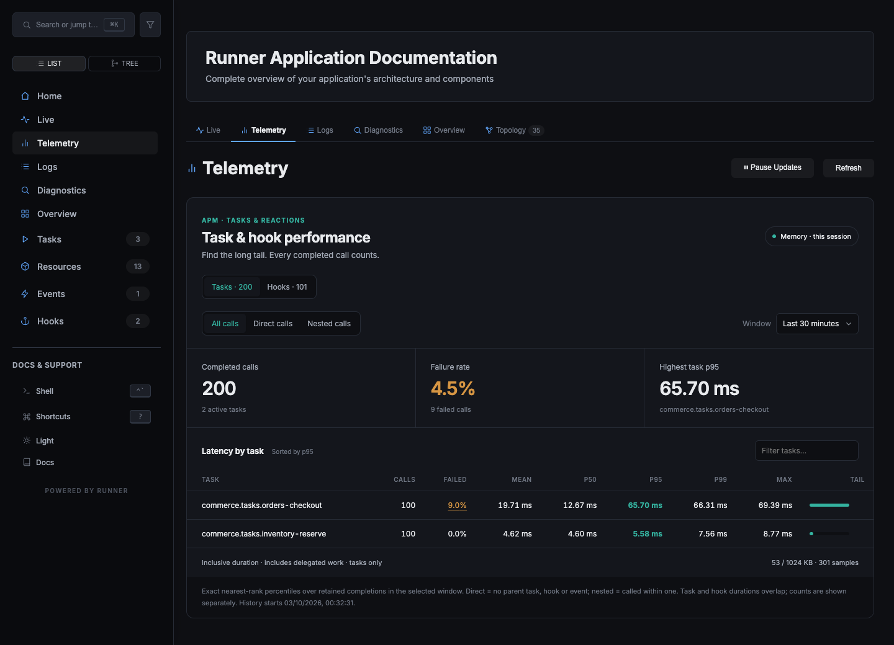
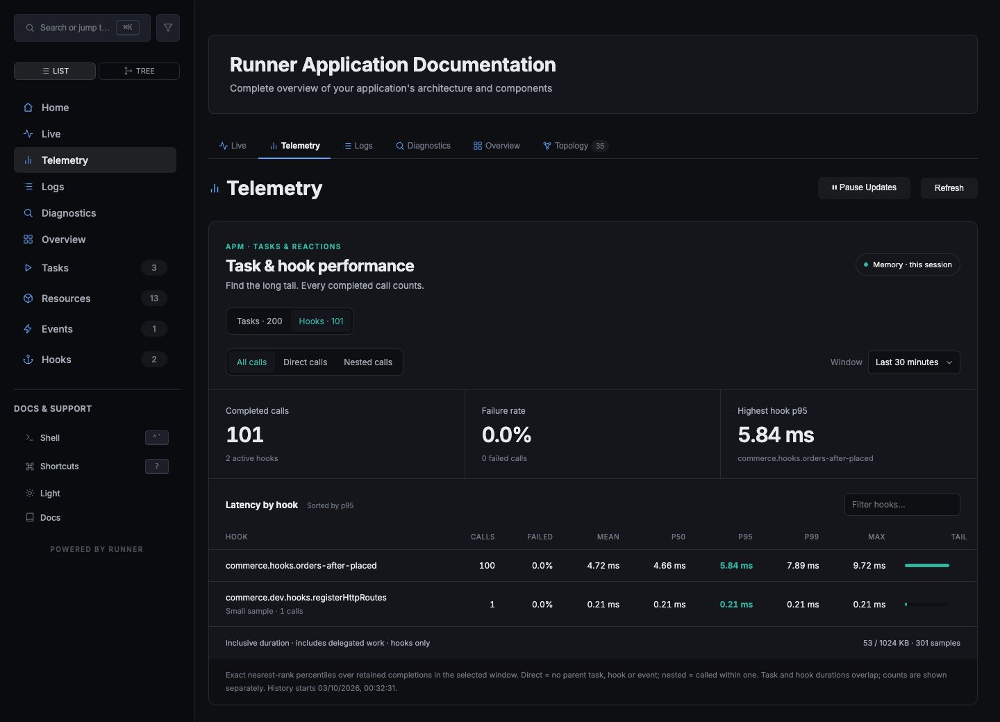
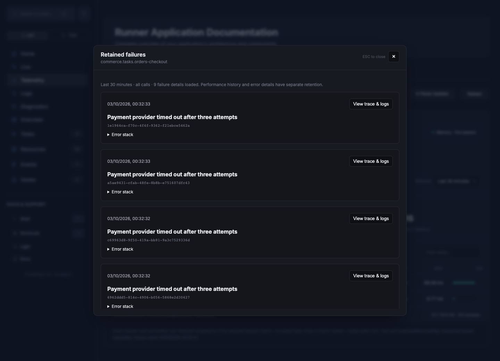

# Telemetry performance measurements

SQLite APM was the large, repeatable overhead source: it performed a synchronous
transaction and retention scan for every completed call. Batching 1000 samples in
one transaction and trimming once per batch reduced the median no-op call from
937.65 µs to 15.70 µs in this comparison (about 60× faster). A nested call went from
2102.59 µs to 27.97 µs. These are synthetic throughput measurements, not production
latency guarantees.

Runner-dev still adds work: task/hook interception, correlation context, timing,
retained run records, and optional APM samples. In the candidate, Runner alone took
2.31 µs per no-op; the full dev server with APM disabled took 5.33 µs. Very short CPU
calls can therefore see a large relative change, even when the absolute cost is
only a few microseconds. Registering the HTTP/GraphQL server did not establish a
large additional per-call cost compared with live instrumentation alone.

## Method and limits

Measured on macOS arm64, Node 25.7.0, in a separate worktree. The baseline is commit
`ae17dd1705dba0c445d54fe2521f48d356714d15`, before buffered SQLite and shared byte
retention. Both artifacts used the same installed Runner and dependency versions.
The benchmark times the entire awaited `runTask` call, including instrumentation;
APM's own duration stops before it records the completion.
Three fresh processes per version/mode ran in alternating version/mode order.
Each process warmed 10,000 no-op and 3,000 nested calls, then measured seven trials
of 1000 sequential calls per workload. Nested calls invoke one child task, producing
two retained completions. The full server was listening on loopback; there were no
concurrent application clients. Dashboard aggregation was measured separately.

The first pass overlapped the full checks and was discarded. The published pass ran
without concurrent builds or test suites, but the desktop and OS remained active.
Even control workloads varied substantially; ranges below are the minimum/maximum
of the three process medians. Differences among memory/live/server modes are too
noisy to claim precise improvement percentages. The SQLite ranges do not overlap.

`live` registers telemetry and live storage; `dev` registers the full server.
Both APM modes register full dev. Default histories retain 10,000 samples, logging
output is disabled, and SQLite uses fresh files with WAL and FULL synchronous mode.
Module imports happen before startup timing; even the Runner control imports the
runner-dev artifact, so process-memory figures in the raw data do not isolate its
import cost. Heap/RSS readings are observations, not leak or memory-budget tests.

## Per-call results

Microseconds per call; median of process medians, with their observed range.

| Version | Mode | No-op task | Parent + child |
| --- | --- | ---: | ---: |
| baseline | runner | 4.22 (2.36–4.52) | 7.45 (5.68–11.53) |
| baseline | live | 7.53 (6.09–17.80) | 11.60 (10.07–12.52) |
| baseline | dev | 7.13 (5.66–9.03) | 18.40 (9.98–29.33) |
| baseline | apm-memory | 11.40 (6.71–18.89) | 12.75 (9.43–17.36) |
| baseline | apm-sqlite | 937.65 (774.97–1817.04) | 2102.59 (1762.47–2328.93) |
| candidate | runner | 2.31 (2.12–2.90) | 3.98 (3.62–4.69) |
| candidate | live | 5.59 (5.13–14.63) | 8.50 (8.36–31.59) |
| candidate | dev | 5.33 (4.80–9.29) | 8.86 (7.52–15.46) |
| candidate | apm-memory | 6.59 (5.30–8.86) | 12.31 (9.70–13.20) |
| candidate | apm-sqlite | 15.70 (12.23–18.60) | 27.97 (22.44–29.48) |

Byte-budget bookkeeping adds UTF-8 serialization and eviction accounting. Separate
candidate measurements with `maxStorage: "1mb"` (same trial method) were:

| Mode | No-op task, µs | Parent + child, µs |
| --- | ---: | ---: |
| apm-memory, 1 MiB | 18.07 (15.23–32.06) | 30.37 (24.82–32.08) |
| apm-sqlite, 1 MiB | 44.36 (35.94–80.05) | 68.74 (52.47–98.64) |

These were separate sequential processes rather than paired controls, so the table
shows measured costs and ranges, not an isolated percentage attributable to bytes.
A 1 MiB budget can retain fewer than 10,000 samples depending on their encoded size.

Tasks awaiting a nominal 1 ms timer were also measured. Actual completion times
varied with OS scheduling: candidate medians were 1.71 ms for Runner, 1.40 ms for
dev without APM, 1.38 ms for memory APM, and 1.40 ms for SQLite APM. Runner appearing
slower than some instrumented modes illustrates the noise; these results cannot
establish a precise percentage of I/O overhead. Baseline SQLite reached 4.68 ms.
The raw file includes all trials, startup/shutdown, memory observations and queries.

Candidate aggregation over 10,000 retained samples had process-median costs of
3.42 ms for memory and 4.50 ms for SQLite. At a 2-second refresh interval, 4.50 ms
would occupy roughly 0.23% of one CPU core for aggregation alone; this excludes
GraphQL serialization, network transfer and browser rendering. The recorded HTTP
measurement is a single cold request, not a steady-state polling benchmark. Larger
sample budgets increase exact percentile sorting work and should be measured with
the application's task distribution. Remote database throughput was not benchmarked;
Redis and ClickHouse retention correctness was checked against real servers.

## Durability and retention

APM SQLite now uses a bounded queue, 1-second flush interval and 1000-sample batches.
Graceful Runner disposal drains it before closing. A process crash can lose pending
samples; committed samples remain durable. Live log/trace persistence retains its
existing synchronous contract. SQLite APM files migrate without losing sequence
progress. Memory eviction releases old payload references; age/count/byte limits
are shared with SQLite, Redis and ClickHouse. The byte limit covers compact sample
JSON, not database overhead, queues or total process memory. A 7-day policy is an
upper age bound; count/byte caps may shorten the available history.

## Reproduce

Build both the baseline and candidate checkouts with the same Node/dependencies.
Run from the candidate checkout:

```sh
node scripts/benchmark-telemetry.cjs --matrix \
  --baseline /absolute/path/to/baseline \
  --candidate /absolute/path/to/candidate \
  --output /tmp/telemetry-performance.json

node scripts/benchmark-telemetry.cjs --mode apm-sqlite --max-storage 1mb \
  --output /tmp/telemetry-byte-budget.json
```

The script uses loopback port 19447 and temporary SQLite files, deleting its database
files after shutdown. Run without other builds/tests to reduce interference.
[Raw measurements](telemetry-performance-results.json) include every published trial.

## Inspected UI

Tasks and hooks use separate views; storage usage stays in the footer. Failure
rates open retained errors with correlation links to available traces and logs.






